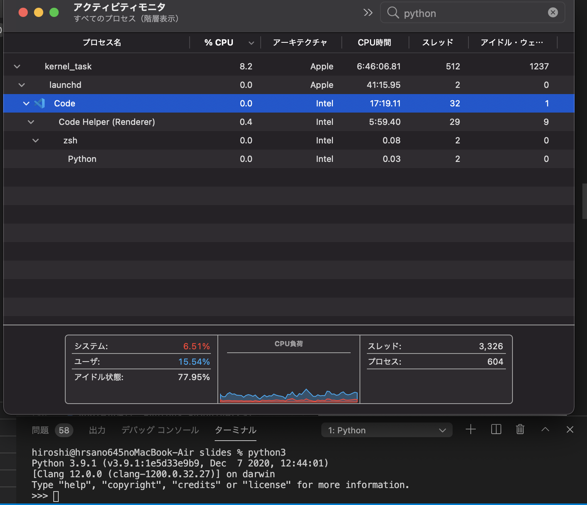

# M1 MacでPythonと機械学習をやろう

### Unagi.py 勉強会37枚目～【祝4周年】機械学習・データサイエンスLT会～

2020/11/20 Hiroshi Sano

---

## お前誰よ

- Hiroshi Sano [@hrs_sano645](https://twitter.com/hrs_sano645) 🏠:静岡の🗻見えるところ
- Job💼
  - [佐野設計事務所🚗⚙️📏](https://sano-design.info)::自動車系機械の3D設計事務所
  - 米農家🌾
- Community🧑‍💻
  - 🗻🐍: shizuoka.py, unagi.py, Python駿河
  - 🗻🐍: PyCon mini Shizuokaスタッフ
  - 🐍: PyCon JP 2020 チュートリアル講師

---

## M1 Macbook Air買いました🎉

---

おススメ！
今日は~~自慢~~布教しに来ました。

---

## まとめ

- M1 Macめちゃくちゃ快適
- Python使うならRossetaモードが基本的におすすめ
- M1最適化のTensorflowを試してみた

---

## M1 Macめちゃくちゃ快適です

---

## M1 Macめちゃくちゃ快適です

買ったもの

- M1 Macbook Air: 124,800円
- CPU 8core / GPU 7 Core
- 256GB: そんなに入れるものがなければ十分
  - 必要なら外付けSSD: 1TB1万円ぐらいで買える
- メモリ 16GB: 8GB

---

## M1 Mac快適なこと一覧

- Macbook Airはファンレス。他のものも通常はファン回らない
- 4K動画流していても平然としてる
- よく使うアプリはほぼ動く: chrome, vscode, office, などなど

---


---

気になったら今すぐ買おう！💸

(mac miniはもっと安いので、そっちもおすすめ)

---

## M1 Macめちゃくちゃ快t...

冬場は冷えたアルミの板

---

## Python使うならRossetaモード

---

## Pythonのインストール

macOS BugSurにはPythonは標準で入ってない

- XCode or Command line tools 必須
  - -> Command line toolsを入れることでPython3.8のUniversal Binaryが入ります
- 3.9は最新版でUniversal Binary対応（3.9.1）
- それ意外のバージョン(2.7はCommand Line toolsに入ってる)はx86バイナリが使えるはず（そもそも使わない）

---

## Universal Binaryとは

- M1 Macはarmとx86両方のバイナリが動く
  - armバイナリはネイティブで動く
  - x86バイナリはRosseta2（というバイナリトランスレーター）で動く
- armとx86（Rosseta）両方対応のバイナリをUnivseral Binaryと呼ぶ

両方動くので、どちらで動いているか確認が必要

---

## バイナリの対応アーキテクチャ確認方法

fileコマンド

```
% file /usr/local/bin/python3.9
/usr/local/bin/python3.9: Mach-O universal binary with 2 architectures: [x86_64:Mach-O 64-bit executable x86_64] [arm64:Mach-O 64-bit executable arm64]
/usr/local/bin/python3.9 (for architecture x86_64):     Mach-O 64-bit executable x86_64
/usr/local/bin/python3.9 (for architecture arm64):      Mach-O 64-bit executable arm64
```

lipoコマンド

```
% lipo -archs /usr/local/bin/python3.9
x86_64 arm64
```
---

## バイナリの対応アーキテクチャ確認方法
 
動いてるプロセスなら、アクティビティモニタを使う（一番簡単）



---

## ターミナル(zsh)でどう動くか

- Bug Sur標準のzsh（デフォルトターミナル）はユニバーサルバイナリ
  - ターミナルアプリでRossetaモードを起動させるか設定で変更可能
- ターミナル上で起動するコマンドはターミナルのアーキテクチャに従う（らしい
- サードパーティのターミナルアプリでは利用しているバイナリの種類で決定するらしい
  - 例: x86のVS Codeからターミナル起動 -> x86のzshが起動

---

## ターミナル(zsh)でどう動くか

ターミナルがどのアーキテクチャで動いているかを確認するには`uname-m` or `arch`コマンドが良い。

```
% arch
i386
% uname -m
x86_64
```

---

## ターミナル(zsh)でどう動くか

archコマンドを使ってzshのプロンプトカスタマイズするとさらにわかりやすい

```
## .zshrc に記載
export PROMPT="%n@%m(`uname -m`) %1~ %## "

## sourceコマンドで読み込む
hiroshi@hrsano645noMacBook-Air slides % source ~/zshrc
hiroshi@hrsano645noMacBook-Air(x86_64) slides % 
```

---

## そのPythonどっちのバイナリで動いてるの？

起動するターミナルのアーキテクチャで変わるので、意識して確認しよう。

---

## ArmのPythonって使える？

---

## ArmのPythonって使える？

- 標準では至って普通に動く
- venvも普通に動く。Pure Pyhtonなら問題ない（と思われる
- pipが問題

---

## pipのアップグレードの様子

```
hiroshi@hrsano645noMacBook-Air(x86_64) test_arm_venv % arch -arm64e zsh
hiroshi@hrsano645noMacBook-Air(arm64) test_arm_venv % python3 -m venv .env
hiroshi@hrsano645noMacBook-Air(arm64) test_arm_venv % source .env/bin/activate
(.env) hiroshi@hrsano645noMacBook-Air(arm64) test_arm_venv % pip install -U pip
Collecting pip
  Using cached pip-20.3.3-py2.py3-none-any.whl (1.5 MB)
Installing collected packages: pip
  Attempting uninstall: pip
    Found existing installation: pip 20.2.3
    Uninstalling pip-20.2.3:
      Successfully uninstalled pip-20.2.3
Successfully installed pip-20.3.3
(.env) hiroshi@hrsano645noMacBook-Air(arm64) test_arm_venv % 
```
Rosseta(x86)モードの標準ターミナルからarmバイナリのzshを起動してvenv上で試す。

none-anyなら大丈夫そう

---

## pipがmacos armに対応してない

- pipの仕様にmacOSのArmアーキテクチャを考慮してないからインストールもwheel生成もできない（まだらしい？
- 依存関係でちょっとでも引っかかると色々面倒（手動で解決しないといけない）

[Python 3.9.1の macOS Big Sur/Apple Siliconサポート - python.jp](https://www.python.jp/news/2020-12-07-macos-bigsur.html)

[pip 20.3 release (Q4 2020) · Issue #8936 · pypa/pip](https://github.com/pypa/pip/issues/8936#issuecomment-735450632)

---

## macos armのpipでnumpyを入れると

```
(.env) hiroshi@hrsano645noMacBook-Air(arm64) test_arm_venv % pip install numpy  
Collecting numpy
  Using cached numpy-1.19.5.zip (7.3 MB)
  Installing build dependencies ... done
  Getting requirements to build wheel ... done
    Preparing wheel metadata ... 
```

ソースビルド走っちゃう（そもそもwheelのバイナリないし）

---

## 現時点ではM1 MacでArmネイティブのPythonの常用は難しい

意欲ある方はコントリビュートのチャンスです！M1 Mac買いま（略

---

## Rossetaモードだとどうなの？

- 至って普通に動く。venv, pip などなど
- ただpipは最新版にする必要あり:
  - 正しくバイナリ判定がされなくてソースビルドが走ることが多々
  - pipの最新: pip-20.3.3
  - `pip install -U pip` これ絶対
- 性能はRosseta依存: GPUとかの扱いよくわからん

Web開発ぐらいなら問題なく使えると思います。

---

## Rossetaモードだとどうなの？


```
(.env) hiroshi@hrsano645noMacBook-Air(x86_64) test_86_venv % pip install numpy
Collecting numpy
  Using cached numpy-1.19.5-cp39-cp39-macosx_10_9_x86_64.whl (15.6 MB)
Installing collected packages: numpy
Successfully installed numpy-1.19.5
```

---

## Rossetaモードだとどうなの？

（やっていて気がついたこと）

- 現時点でpandasをpipenvで入れるとpip lockがちゃんとできない
  - 今のところ、素直にvenv, pipを使ったほうがいいと思う

---

## Rossetaモードでnumpyベンチマークしてみる

提供: [オーイシさん (@oec014)](https://twitter.com/oec014)さん

比較対象は

- Ryzen 5800X / メモリ32GB
- M1 Mac:python3.9.1 Rossetaモード
- M1 Mac:Python3.8.2 armネイティブ
  - tensorflow-macosのnumpy利用
  
---

## Rossetaモードでnumpyベンチマーク 結果


---

# 所感

- arm nativeやばい（震え
- rossetaが振るわないのがCPUのトランスコードの問題なのか、メモリなのかは不明
  - CPUはベンチ回している間、各コアは90%は超えていたがずっと
  100%ではなかった。その辺なる

armネイティブ環境は夢がある

---

気になったら今すぐ買おう！💸

（いやMac Pro待ったほうがいいかもだけど）

---

## M1最適化のTensorflowを試してみた

---

## tensorflow-macosがある

- Appleが専用のビルドをしたものを公開
  - 
- numpyもビルドずみ: armネイティブでビルドさせようとしてもできなかった
- pandasは入ってないらしい。


---

からあげ先生のAI本のコードを試す

---


---

## まとめ

- M1 Macめちゃくちゃ快適
- Python使うならRossetaモードが基本的におすすめ
- M1最適化のTensorflowを試してみた

---

気になったら今すぐ買おう！💸

ただ冬場は冷たいです

---

参考

- [M1 Mac](https://oku.edu.mie-u.ac.jp/~okumura/macosx/m1.html)
- [M1 Macの開発環境 - Qiita](https://qiita.com/shibukawa/items/797b7cbb7e530842e6f7)
- 