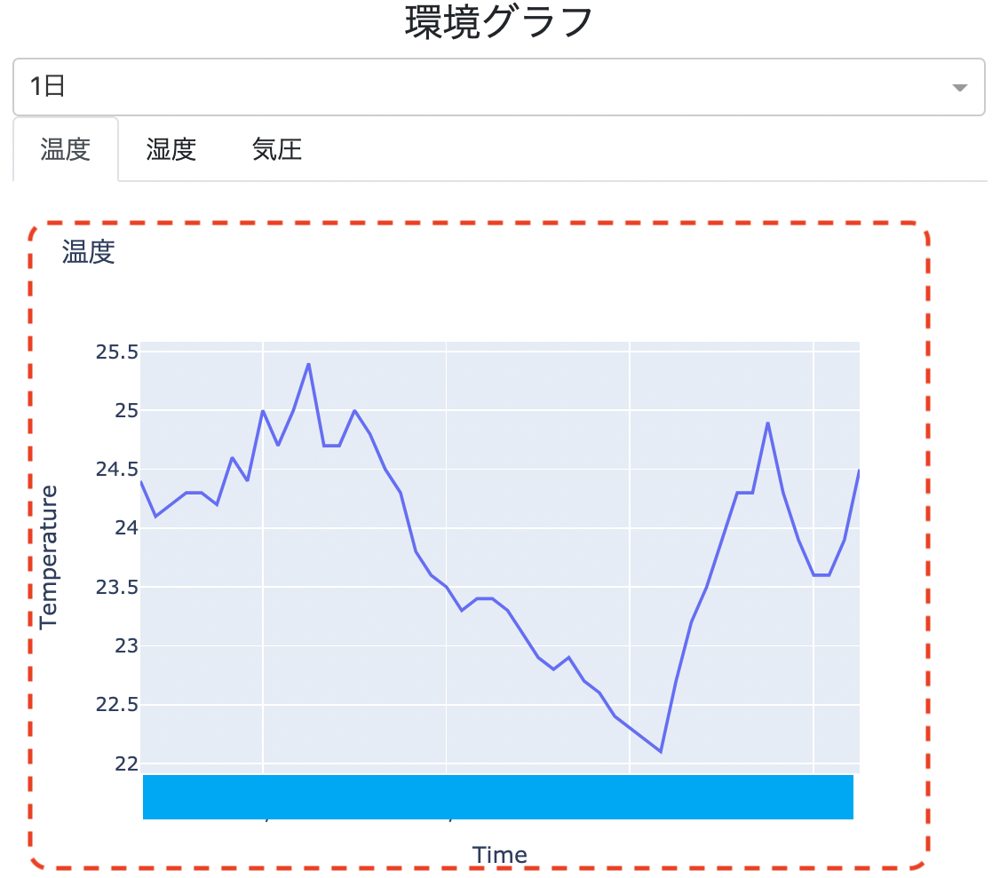
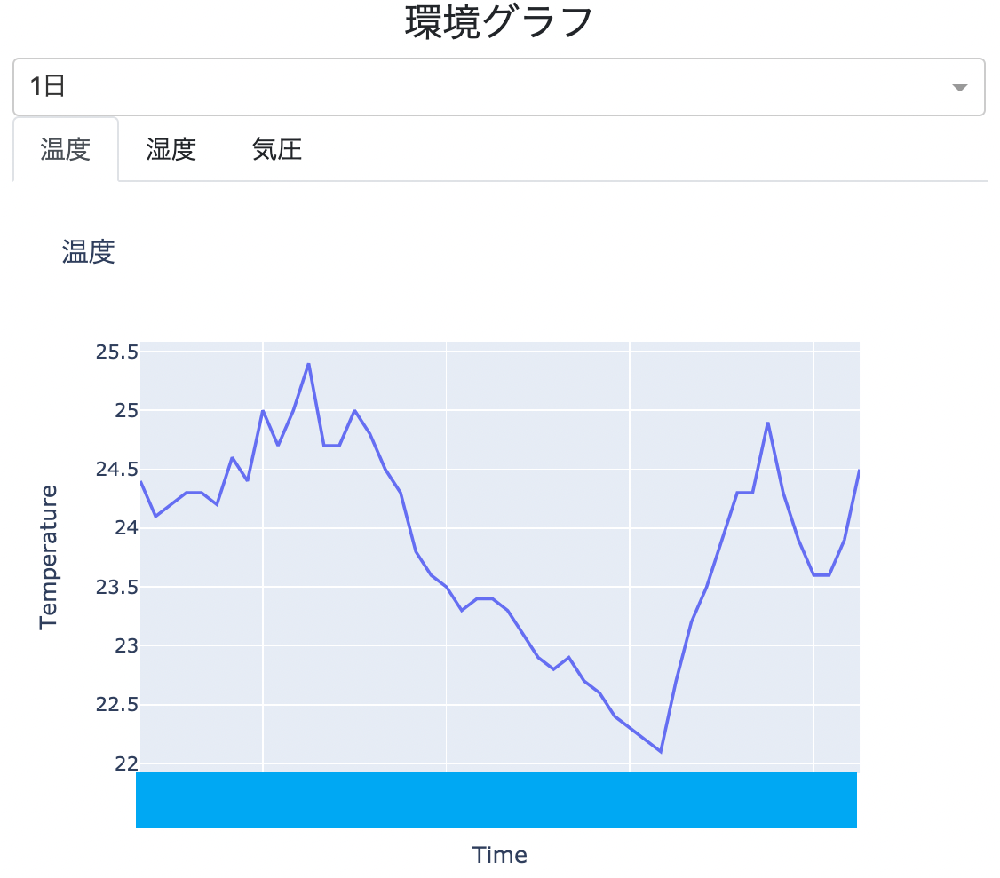

## Dash+環境センサーで家環境ダッシュボードを作った話

PyCharity LT 2021/02/20

Hiroshi Sano

---
## お前誰よ

---


# Hiroshi Sano [@hrs_sano645](https://twitter.com/hrs_sano645) 

# 🏠:静岡の🗻見えるところ

---

# Community🧑‍💻

- 🗻🐍: shizuoka.py, unagi.py, Python駿河
- 🗻🐍: PyCon mini Shizuokaスタッフ
- 🐍: PyCon JP 2020 チュートリアル講師

---

# 宣伝

---

# 静岡Pythonコミュニティの勉強会 Python駿河

# 2/27（土）です！来週！

---

「Pythonプロフェッショナルプログラミング 第3版 Chapter 05 課題管理とレビュー」

つまみ食い読書します。ぜひ遊びに来てください！

参加方法はconnpass検索、#pycharityに流します

---

# PyCon mini Shizuoka 2021

---

# 開催日まだ未定ですが、年内にできたらで

スタッフ募集中です！🙏

---

# #pycharity 二回目🎉

---

# 開催めでたい

---

# LTラストバッター

---

# めっちゃ緊張

---

# そのLTですが

---

# 1週間前にリハーサルしてから

<!-- footer: "タイトルだけ用意してあった" -->

---

# 前日から作ろうと思ってたものの

<!-- footer: "そのほうがほんもの感出ると思ってた..." -->

---

# 今日の朝から作りました

<!-- footer: "すっかり忘れてた😇" -->

---

# このスライドの作り方は

<!-- footer: "" -->

---

# 高橋メソッドです（もはや懐かしい？

<!-- footer: "[高橋メソッド](http://www.rubycolor.org/takahashi/) 今見たら2005年に初出" -->

---

# 今日言いたいことは

<!-- footer: "" -->

---

# 1. 可視化のアプリを作って思ったこと

---

# 2. Plotly Dashというダッシュボードアプリ

# フレームワーク便利

<!-- footer: "[Dash Documentation & User Guide | Plotly](https://dash.plotly.com/)" -->

---

# 3. IoTとの連携はPythonが手軽

<!-- footer: "" -->

---

# まず趣味プロジェクト、homeenvdashの紹介

---


<!-- footer: "[hrsano645/homeenvdash: 家環境ダッシュボードのダッシュボード部分](https://github.com/hrsano645/homeenvdash)" -->

---

# 一言でいうと

<!-- footer: "" -->

---

# 家の環境をセンシングしてダッシュボード化する

---

# まあよくあるプロジェクトと思う

---

# 中身はこんな感じで

---


<!-- footer: "iPadで書いた" -->

---

# やってみて思うことですが

<!-- footer: "スライド作っていたら余裕が出てきたので図が入りました" -->

---

# 1. 可視化アプリ作って思ったこと

<!-- footer: "でもさっきまでスライド直してた" -->

---

# センシングとデータ可視化は結構よくあるネタ

<!-- footer: "" -->

---

# 元々は家の環境を手軽に見ることを解決したくて始める

---

# 気圧見れるのがとても便利

# 低気圧にとても弱いので状況判断しやすい

みなさんもストレートネックなど首回りにはお気をつけください

<!-- footer: "ちなみに気圧は「頭痛ーる」といった予報サイトやAndroid+Googleの天気情報でもみれます。" -->

---

# 実家では祖母の介護で見守りにも使う

<!-- footer: "" -->

---

- ちゃんとエアコンついてるか
- 暑すぎないか寒すぎないか
- 乾燥してないか

---

# そこから思うこととして

---

# 何か見たい=何かを知りたいから

---

# 気圧見たい -> 不調の原因は気圧に関係しているらしいから調べてみる

# 祖母の様子見守りたい -> 祖母の体調の心配

---

# 断片的な情報は混乱しか生まない

---

# 自分の調子悪い -> 何が原因だろう？を探したくなる

# ある人の体調が気になる -> 精神的につらい、いつも気にする

---

# ITのシステムにも同じことは言える

---

# 見ることができる（測定できる）環境を大事にする

---

# 2. データ分析 -> アプリ化にはPlotly Dash便利

---

# pandasを使えるならすぐにグラフ化出来る

---



---

```
df = [[日付],[温度]の行列]

fig1 = px.line(df, x="Time", y="Temperature", title="温度")

dcc.Graph(id="tempature", figure=fig1), label="温度"

```

<!-- footer: "DataFrameの前処理についてはまあ頑張ってください" -->

---

# 使っていて感じたこと

<!-- footer: "" -->

---

# ?. デザイン面倒

---

# WEBアプリなのでCSSとかカラムとか考えないといけない


<!-- footer: "ちょっとだけ感じます。ちょっとだけです。" -->

---

# A. bootstrapを使えるコンポーネントがある

[Dash Bootstrap Components](https://dash-bootstrap-components.opensource.faculty.ai/)

<!-- footer: "" -->

---

# ?. コンポーネントツリーが見づらい問題

---

# webアプリだけど、html書かなくていい👍

# htmlの構造表現をPythonで行う🙄

---

```
return dbc.Container(
    [
        dcc.Location(id="url", refresh=False),
        html.H2(config.TITLE),
        html.Hr(),
        dbc.Row(
            [
                dbc.Col(
                    [dbc.Label("場所: "), location_dd, latest_view],
                    md=4,
                    id="sidebar",
                ),
                dbc.Col(main_view, md=8),
            ],
        ),
```

---

# アプリの構造が複雑になるとネストも増える

---
# 必要なブロックを名前つけて管理

---




<!-- footer: "デザイン勉強中です..." -->

---

```
date_dd = [日付の種類]
graph_tab = [グラフのタブをまとめたもの]

# グラフとタブのビュー
main_view = html.Div(
    [
        html.H4("環境グラフ", style={"textAlign": "center"}),
        date_dd,
        graph_tab,
    ]
)
```

<!-- footer: "" -->

---

# スッキリ

---

# 日本語情報少ない

---

# 書籍買おう！

---


<!-- footer: "[朝倉書店｜Python インタラクティブ・データビジュアライゼーション入門](https://www.asakura.co.jp/books/isbn/978-4-254-12258-9/)" -->

---

# とっても丁寧な説明とリファレンスにも使える


<!-- footer: "" -->

---

# 3. IoTはPythonとの親和性が良すぎる


<!-- footer: "ところで後何分？" -->

---

# IoTをPyhtonで動かす環境

<!-- footer: "" -->

---

# ラズパイとかMicropythonとかで使える

ラズパイ: Raspberry Pi 小型のLinux開発ボード

micropython : マイクロコントローラー向けのPython環境

<!-- footer: "micropythonが動く ラズパイpico は今日のトークで紹介されてましたね" -->

---

# ライブラリそろってる = めっちゃいい環境

<!-- footer: "" -->

---


# adafruitのCurcitPython向けのライブラリ

adafruit: オープンハードウェアなIoTキットや電子部品を販売する英国の会社

CurcitPython: Micropythonのフォーク版

<!-- footer: "変化球な紹介ですが…便利だったので" -->


---

# 少ないコードでセンサー情報取れる

<!-- footer: "" -->


---


```
import board
import busio
import digitalio
import adafruit_bme280

spi = busio.SPI(board.SCK, MOSI=board.MOSI, MISO=board.MISO)
# D5は任意のGPIOピン
cs = digitalio.DigitalInOut(board.D5)
bme280 = adafruit_bme280.Adafruit_BME280_SPI(spi, cs)

print("\nTemperature: %0.1f C" % bme280.temperature)
print("Humidity: %0.1f %%" % bme280.humidity)
print("Pressure: %0.1f hPa" % bme280.pressure)
```

--- 

# まとめ

---

# 可視化をしたい目的/動機があればぜひやろう

---

# Pythonなら可視化しやすいよ！

<!-- footer: "趣味プロジェクト homeenvdash これからもがんばります" -->

---

# Thanks！

<!-- footer: "" -->

---


---

時間あったらしゃべる↓

---

今後もっと使いやすくしたい

---

センサー対応を増やしたい

---

CO2とか

照度とか

スマートカメラの画像がみれたりすると防犯向けにも使える

---

設定ベースでできるようにする

---

センサーに対応するために毎回コード書くの面倒

決まった組み合わせでつなげばすぐに使えるようにしたい

---

データは外部に置かないでなるべくローカル

---

Google スプレッドシート is クラウド

---

センサーは個人な情報も入ってしまうので、出来るだけ内部にしたい

---

センサーノード側はFastAPIあたりでjsonで出し続けて

ダッシュボード側はセンサーノードからの情報をプルしてデータをためて可視化

---

進捗出たらどこかで発表を目標です。CfP頑張る。

---

Thanks!