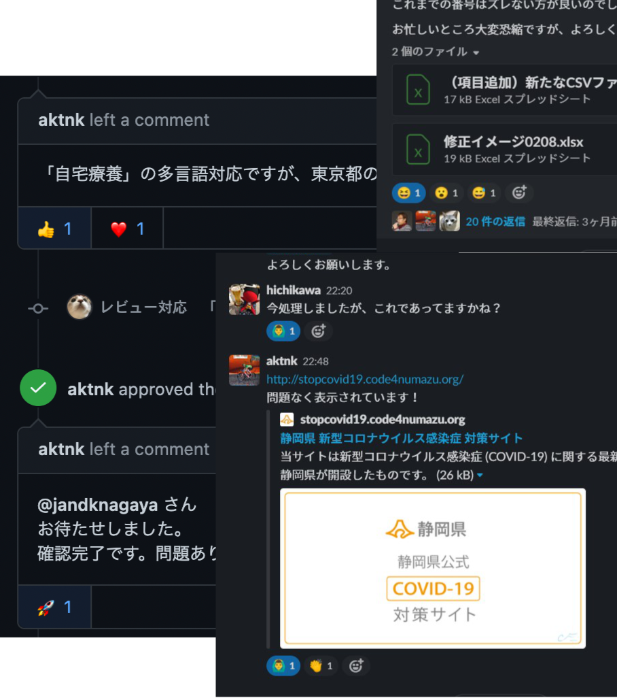

# 2020年の新型コロナと静岡シビックテックの1年話

CIVIC TECH FORUM 2021 2021/05/15
佐野浩士

---

## お前誰よ

- 佐野浩士（Hiroshi Sano）[@hrs_sano645](https://twitter.com/hrs_sano645) 🏠:静岡県の富士市🗻
- Job💼
  - [佐野設計事務所🚗⚙️📏🖊️](https://sano-design.info)
    - 自動車系機械の3D設計事務所 IT/雑務何でも屋
  - 米農家🌾
- Community🧑‍💻
  - 🐍: Python駿河, PyCon mini Shizuokaスタッフ
  - Code for ふじのくに
- fuji.5374.jp

<!-- _footer: 「お前誰よ」はPython界隈ではよく使われる「自己紹介」の意味です -->

---

去年のPre CIVIC TECH FORUM Online 2020にて登壇しまして

---

<!-- _footer: "スライドはこちら -> [民間支援情報ナビの静岡県版を作った話](https://docs.google.com/presentation/d/1kNGc2JDnKnGVmSeQ9CeKS_GjwRDu4Hx2JitOKFwpi3s/edit?usp=sharing)" -->
---

そこから1年立ち、現在の様子をを共有します

---

# 2020年の新型コロナと静岡シビックテックの1年話

---

あれから1年…色々ありましたね。

<!-- _footer: もう一年立ってしまいました。現在もまだまだ色々とありますね… -->

---

2020年の間のできごとを共有します

- 民間支援情報ナビ for 静岡版のその後
- 新型コロナ対策サイトの静岡版と地域版のフォークを作った話
- 1年シビックテックプロジェクトに関わって感じたこと

<!-- _footer: シビックテックをやり続けた個人的な雑感です。誤りなどありましたら教えていただけると嬉しいです-->

---

## 民間支援情報ナビ for 静岡版のその後

---

## 民間支援情報ナビ for 静岡版の１年

- 2020/4月初め: サービス立ち上げ
- 2020/4月: サービス開始
- 2020/5月: 静岡県向けの機能追加
- **2021/3月: サービス終了アナウンス**

役目を果たしたとして、終了をアナウンス👋

<!-- _footer: 参加いただいた静岡シビックテッカーみなさんありがとうございました🙇 -->

---

## 民間支援情報ナビ for 静岡版の役割

- 当初の目的: **静岡県内の民間が提供する支援情報の提供**
- 始めた当初は情報が錯綜していて混乱 -> まとめることに価値がある
- 緊急事態宣言→混乱も落ち着いてくる（ある種慣れてきている）

この1年で当初の目的は達成したと思います。

<!-- _footer: "[VS COVID-19 #民間支援情報ナビ For 静岡県版](https://vs-covid19-shizuoka.netlify.app/)" -->

---

## 民間支援情報ナビ for 静岡版でやったこと

- 地域別でフィルター👍
- 全国版への追従

<!-- _footer: -->

---

## 機能追加: 地域別でフィルター

<!-- <左側に写真載せる> -->

静岡県は横に長く4つのブロックに分かれる

より地域に沿った支援情報を得るためにフィルター機能を用意

<!-- _footer: "[issue-27 地域検索のUI実装 by hrsano645 · Pull Request #46 · hrsano645/vs-covid19](https://github.com/hrsano645/vs-covid19/pull/46)"-->

---

## 民間支援情報ナビ for 静岡版

改めて参加していただいた方みなさんに感謝🙇

[vs-covid19/CONTRIVUTORS.md at for-shizuoka-custom · hrsano645/vs-covid19](https://github.com/hrsano645/vs-covid19/blob/for-shizuoka-custom/CONTRIVUTORS.md)

---

## 新型コロナ対策サイト静岡版/地域版のフォークを作った話

静岡県の中では対策サイトはいくつか作成、運用がされています

---

  
（[静岡県:shizuoka.stopcovid19](https://stopcovid19.code4numazu.org/)、[富士市:fuji.stopcovid19](https://stopcovid19-fuji.netlify.app/)）

「Code for ふじのくに」に集まった有志メンバーで担当

- 静岡市版と浜松市版もあります。それぞれ別の有志チームで作成
  - [静岡市 新型コロナウイルス感染症対策サイト](https://stopcovid19.city.shizuoka.lg.jp/)
  - [浜松市 新型コロナウイルス感染症対策サイト](https://stopcovid19.code4hamamatsu.org/)

<!-- _footer: 静岡市版のチームの方に静岡県側もPR頂いたり、助けていただきました！ -->

---

## shizuoka.stopcovid19, fuji.stopcovid19のイベント

- 2020年6月
  - サービス開始👍
  - 翻訳対応👍
- 2020年12月: 各方面からの要望盛り込み/修正
- 2020年12月 - 2021年1月: 西暦対応、不具合対応👍
- 2021年1月: fuji.stopcovid19を立ち上げ 👍
- 2021年4月: ニュース対応中👍

<!-- _footer: "shizuoka.stopcovid19, fuji.stopcovid19 はこの発表の便宜上そう呼んでいます。ドメインなどは違います。" -->
---

## 有志メンバーで集まってやってます!

役割自体はあんまり決まってません

- 市川ご夫妻（Code for ふじのくに）: 立ち上げ、地域向けカスタマイズ
- 佐野@hrsano645: 対策サイトのデータ生成
- @aktnk（Code for SUSONO）: 対策サイトのフロントエンド
- @J.Nagaya: サイト上の翻訳情報
- @Jyury11: 開発環境整備

<!-- _footer: "実はみなさんIT系エンジニア方面 -> [covid19/CONTRIBUTORS.md at development · hiroyuki-ichikawa/covid19](https://github.com/hiroyuki-ichikawa/covid19/blob/development/CONTRIBUTORS.md)" -->

---

## 翻訳対応

<!-- <左に写真を載せる> -->

- 静岡県向けに追加したリンクや地域の名称の翻訳をしました
- 静岡県の保健所各所から集まる情報はばらつきが多い
  - 一例:「10代後半」「60代以上」「県東部」「静岡市葵区」「富士保健所管内」「浜松市内」「県外在住」🤯
- できれば翻訳サービス（AWS Translateとか）とかを挟んだ方がいいかもしれない

<!-- _footer: "[8/7時点で多言語対応できていない語句 · Issue #40 · aktnk/covid19](https://github.com/aktnk/covid19/issues/40)" -->

---

## 西暦対応

<!-- <左に写真を載せる> -->

- 年末に東京都の仕様に会うように追従
- この頃には東京都側はかなり拡張
  - プロジェクトで使われている依存パッケージも追い続けるのが大変
  - vue, nuxt系になれてる方は大丈夫かもしれません…

<!-- _footer: "[日付表示に西暦を追加する · Issue #60 · aktnk/covid19](https://github.com/aktnk/covid19/issues/60)" -->

---

## 別地域へフォーク

<!--  -->

<!-- <左に写真を載せる> -->

- 静岡県富士市の役所の方より、富士市版もできないかと相談
  - 相談当時、富士市でも感染者数が増えていた
- 静岡県のオープンデータから地域別にデータを書き出せる機能を作成
  - 「最新のお知らせ」対応の時もオープンデータ提供を実現

富士市の協力と静岡県の立ち上げノウハウもあったので立ち上げ早めでした

<!-- _footer: "プロジェクトはこちらです -> [hiroyuki-ichikawa/fujicity_covid19](https://github.com/hiroyuki-ichikawa/fujicity_covid19)" -->

---

## ニュース対応（予定）

新型コロナ対策サイトにある「最新のお知らせ」の対応

- 静岡県はスクレイピング（1日1回）で更新
- 富士市はオープンデータ提供となったので更新が非常に楽

近々更新予定です！

<!-- _footer: "[news.jsonを生成する · Issue #10 · hrsano645/covid19-gen-datajson-shizuokapref](https://github.com/hrsano645/covid19-gen-datajson-shizuokapref/issues/10)" -->

---

## 1年間、シビックテックプロジェクトに関わって感じたこと

- フォークプロジェクトを運用する楽しさと難しさ
- 有志チームでどうやっていくか
- 非同期なツールを使いこなす。コミュニケーションも

<!-- _footer: ここからは雑感な話です -->

---

## フォークプロジェクトを運用する楽しさと難しさ

- 最新のWeb開発技術の扱いを学べる
  - JavaScript、Docker、GitHub Action
- OSS開発 / GitHub上でのコミュニケーション方法

エンジニアとして学ぶことが多かった

<!-- _footer: OSS開発に参加してレベル上がった気がする💪 -->

---

## フォークプロジェクトを運用する楽しさと難しさ

フォーク元のプロジェクトはCode for Japanで行っているため（相対的には）強い組織。

でもフォーク先（地域）はそこまではないと思われる

追いつくのには無理がある。できるところをピックアップしてみました。

<!-- _footer: 現在の新型コロナ対策サイトで地域版を作ろうとしたときには、開始当初と同じような方法論は難しいかも -->

---

## 大変だった例: フォーク元の追従してサイトの表示が崩れる問題😇

- 東京都の修正を盛り込む→なぜかサイトの表示が崩れてしまう
  - 依存しているライブラリが正しく追従できていない、静岡県の独自のカスタマイズで誘発する？など
- 良かれと思って盛り込んだら大変だった話

<!-- _footer: "[公開サイトの表示が崩れる · Issue #55 · aktnk/covid19](https://github.com/aktnk/covid19/issues/55)" -->

---

## 有志チームでどうやっていくか

シビックテックを有志で進めるとき、優先できないものでもある。

- 仕事、本業: 多忙だったりして時間作れない
- 私生活もある: 子育て、介護も

自分の人生優先だけど、思いを持って進めてるプロジェクトの進捗がよくなかったりすると、ちょっともどかしい

<!-- _footer: 自分も本業多忙だったりすると、優先順位は一番下になっちゃいます -->

---

## ボランティアとしてみんなで助け合う

助け合い、支え合い大事、できたこと

やったことをみんなで見て褒めていこう

リアクション大事！

<!-- _footer: 基本みんなでほめて楽しみたい！ -->

---

## 非同期なツールを使いこなす

フルタイムではないので限られた時間で進めるしかない

⏬

進めるために（時間効率をあげるため）非同期なツールを使いこなす

---

## 非同期なツール何使ったの？

GitHub, Slack, Google Docs

- サービスのデプロイもなるべく自動（CI使う
- コミュニケーションもチャットベース

<!-- _footer: 定番だしあるあるではある -->

---

## 人が主役なんです🙋‍♂️

人が頑張るよりツールに頼る

人がやるべきことを気持ちよくできるように整備を続ける

<!-- _footer: この考え方はPythonのコミュニティで学びました -->

---

## まとめ

静岡シビックテックな取り組みで1年やってきたこと雑感でした。

- 民間支援情報ナビ for 静岡版のその後
- 新型コロナ対策サイトの静岡版と地域版のフォークを作った話
- 1年シビックテックプロジェクトに関わって感じたこと

ボランティアとして取り組む喜びもですが、学びや悩みも増えました。

<!-- _footer: 思えば、今も「非常事態」な状態と思います。みんな頑張ってる。 -->

---

## 対策サイトの今後

対策サイトも役目を果たし終えるまでは続けていこうと思います

今後はワクチンの摂取状況や連絡方法を載せられるといいなーと思ってます

ボランティアなシビックテックどうあるべきかやっぱり悩みますが、長く続けることを目標にしてみます

<!-- _footer: 来年はもうちょっと非常事態感減っていて欲しいですね。関わってる皆様お疲れ様です -->
