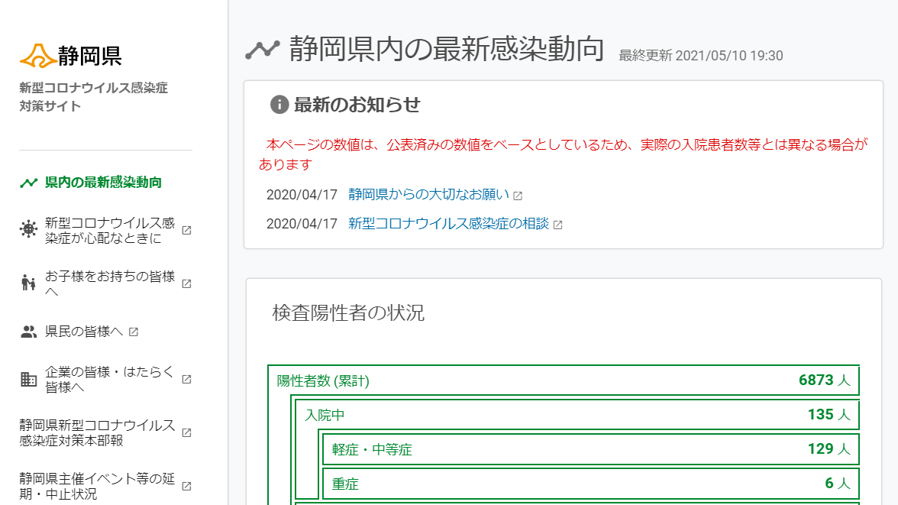
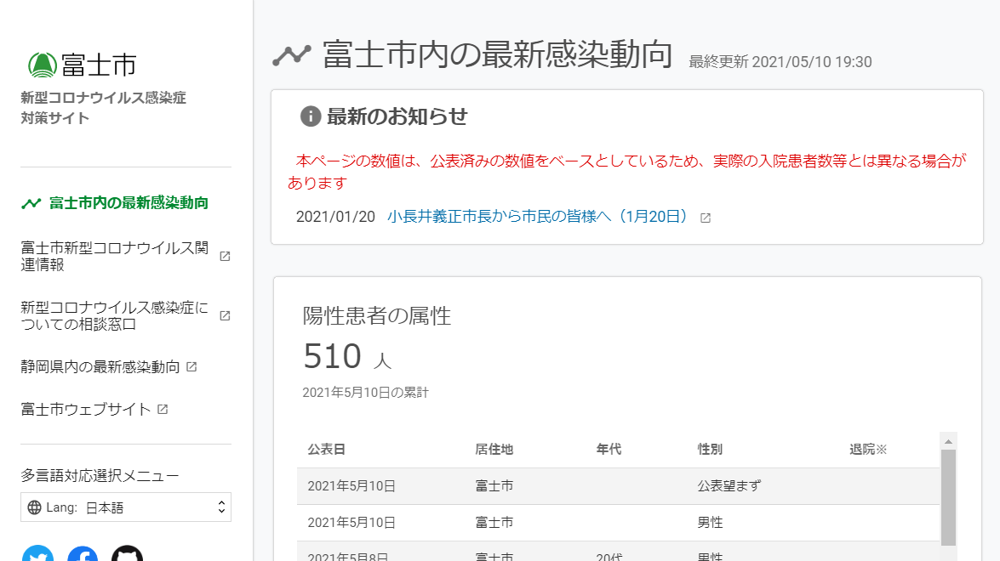

# ほぼPython標準ライブラリでオープンデータを触った話

2021/07/16 はんなりPython LT


---

## お前誰よ

- 佐野浩士（Hiroshi Sano）[@hrs_sano645](https://twitter.com/hrs_sano645) 🏠:静岡県の富士市🗻
- Job💼
  - [佐野設計事務所🚗⚙️📏🖊️](https://sano-design.info)
    - 自動車系機械の3D設計事務所 ソフトウェアエンジニア 他いろいろ
  - 米農家🌾
- Community🧑‍💻
  - 🐍: Python駿河, PyCon mini Shizuokaスタッフ
  - 🏙💻: Code for ふじのくに

<!-- _footer:  -->

---

ほぼPython標準ライブラリでオープンデータを触った話

<!-- _footer:  -->

---

ってどういうこと？

<!-- _footer:  -->

---

## このLTの趣旨

- 気軽にオープンデータを扱ってみよう
- Pythonの標準ライブラリでも何とかいける
- LTなのでオチはない

---

# LT、ことの始まり

---


## 新型コロナ対策サイトの地元版やってます

- 静岡県（住んでる県
- 富士市（住んでる市

<!-- _footer: 有志チームでやってます。静岡市と浜松市にもあります -->

---

  
（[静岡県](https://stopcovid19.code4numazu.org/)、[富士市](https://stopcovid19-fuji.netlify.app/)）

---

## 「新型コロナ対策サイト」とは

「新型コロナ対策サイト」はシビックテックという取り組みで製作されたプロダクト

- 東京都/Code for Japan が東京都版を作成
  - https://github.com/tokyo-metropolitan-gov/covid19
  - 利用するデータのフォーマットやサイトの作成方法がほとんど公開されてる
  - issueやPRの受付も大歓迎 -> 2020年に一気に注目を浴びる
- OSSで作られている -> フォーク可能
- そのほか地域に広まる
  - FORKEDSITE -> https://github.com/tokyo-metropolitan-gov/covid19/blob/development/FORKED_SITES.md

---

### サイトのデプロイの様子


---

どこにPythonつかってるの?


---

### 新型コロナ対策サイトを動かすためにデータを作る

- オープンデータはCSVで提供される
  - テキスト形式でカンマ区切り
- CSV形式の情報を元に、専用のjsonファイルを作る
- データの前処理はある程度必要
  - オープンデータあるある😇

---

### 諸事情でPythonオンリーで始める

- 当時はデプロイ周りをサーバー側で行うことにした
- Pythonの環境は3.7あたりが入ってることは把握
- 立ち上げ早めに動きたかったので、データ処理を突貫で進める
 -> ちょっとずつ改善していくことにした

**Python標準でなんとかなるっしょ！で始めた**

---

### 変換するためのスクリプトを作る

こちら -> https://github.com/hrsano645/covid19-gen-datajson-shizuokapref

- データのダウンロードはサーバー側にあるcurlでやりました
- `csv` あたりを使う
- 前処理は、データの事情をみて処理を作る
- json形式への変換は `json` モジュール

---

本当にPythonの標準ライブラリだけ？

---

本当です！

```Python
# coding:utf-8
import re
import csv
import json
import sys
from collections import Counter, namedtuple
from datetime import datetime, timedelta
```

<!-- _footer: https://github.com/hrsano645/covid19-gen-datajson-shizuokapref/blob/master/patients.py#L1 -->

---

# 中身解説

---


## データのダウンロード

- ここはPythonではなくても正直何でもよかった -> curlとかで十分
- ダウンロードできれば何でも良いのよ

---

## データのダウンロード:Pythonでやるなら

Pythonだけでやるなら `http.client` で良さそう

```python
import http.client

conn = http.client.HTTPSConnection("opendata.pref.shizuoka.jp")
conn.request("GET", "/dataset/8167/resource/46279/220001_shizuoka_covid19_patients.csv")

res = conn.getresponse()
data = res.read()
```

<!-- _footer: オープンデータ公開元 ->  -->

---

```python
# DLしたデータをそのままcsvモジュールに渡して使う
import io
import csv

patients_csv = io.StringIO(data.decode("shift-jis"))
patients_list = list(csv.reader(patients_csv))

# ファイルとして保存したいなら
with open("patients.csv", "wb") as csvfp:
    csvfp.write(data)
```

<!-- _footer: How to Use In-Memory Streams - Speaker Deck https://speakerdeck.com/hayaosuzuki/how-to-use-in-memory-streams -->

---

## CSVファイルを処理する


---

## CSVファイルを開く

ヘッダがあるようなものは csv.DictReaderでやろう。辞書形式で扱える

```
# CSV

受付_年月日,全国地方公共団体コード,都道府県名,市区町村名,相談件数
2020/2/10,220001,静岡県,,0
中略...
```

```python
with open("call_center.csv",encoding="shift-jis") as csvfp:
    call_center_map = csv.DictReader(csvfp)

print(call_center_map[0])
# OrderedDict([('受付_年月日', '2020/2/10'), 
# ('全国地方公共団体コード', '220001'), ('都道府県名', '静岡県'),
#  ('市区町村名', ''), ('相談件数', '0')])
```

---

## データの前処理をする

今回オープンデータで困ったこと

- 冒頭にデータの説明が乗っていたり
  - ~~Excelのこの文化どうにか...~~
- 通常だと作られないような行列構造があったりした
- 各データの表記がブレてる

---


まあまあめんどい

---

### データの前処理をする: 不必要なデータを除外する

冒頭にある説明的なものは行を飛ばしてからファイルを読み込めばいい

```python
with open("patients.csv", "r", encoding="shift-jis") as patients_file:
    for _ in range(8):
        next(patients_file)

    patients_list = list(csv.DictReader(patients_file))
```

---

### データの前処理をする: 例外的な行や列を消す

- 通常だとありえないようなデータ表現がされてしまうことがある
（Excelで作ってるはずだろうになんでだろ？）
- あらかじめわかっているようなものはちゃんと前処理で飛ばす

---

### データの前処理をする:例1

```
# CSV
3895,3901,220001,静岡県,1,2021/1/18,,静岡市,高齢でない成人,男性,,軽症・中等症,発熱、咳,0,1
3896,3902,220001,静岡県,1,2021/1/18,,静岡市,40代,男性,会社員,軽症・中等症,倦怠感,0,1,,
```
⏬
```python
# csv.DictReaderで取り込んだあと
{'No': '3895', 中略...
'患者_渡航歴の有無フラグ': '0', '患者_退院済フラグ': '1', 
'備考': None}
{'No': '3896', 中略...
'患者_渡航歴の有無フラグ': '0', '患者_退院済フラグ': '1', 
'備考': '', None: ['']}
```

No.3896が何やらおかしい。存在しない列ができてる🤔

---

### データの前処理をする:例2

```python
# CSV 前略...
No,例目,全国地方公共団体コード,都道府県名,(中略...)  ,\
患者_性別,患者_職業,患者_状態,患者_症状,患者_渡航歴の有無フラグ,\
患者_退院済フラグ,備考

(中略...) 

,,,,,,,,,,,,,,
,,,,,
```

終端に謎のカンマ

---

```python
# スクリーンショットにあるカンマがヘッダと同じだけある場合
{'No': '', '例目': '', '全国地方公共団体コード': '',
中略...
 '患者_性別': '', '患者_職業': '', '患者_状態': '', 
 '患者_症状': '', '患者_渡航歴の有無フラグ': '', 
 '患者_退院済フラグ': '', '備考': None}
 
# スクリーンショットにあるカンマがヘッダと数が合わない場合
{'No': '', '例目': '', '全国地方公共団体コード': '',
中略...
 '患者_性別': None, '患者_職業': None, '患者_状態': None, 
 '患者_症状': None, '患者_渡航歴の有無フラグ': None, 
 '患者_退院済フラグ': None, '備考': None}
```

csv.DictReaderで取り込むと色々面倒

---

困った時は取り込む前に前処理を入れる

```python

for row in patients_list:
    # 例1: 行内の無効な要素を除去
    for remove_key in ("", None):
        if remove_key in row.keys():
            row.pop(remove_key)

    # 例2: 存在する項目がすべて空文字で、列名の数と実際の項目数が一致していない場合は無視する
    if set(("", None)) == set(row.values()):
        continue
```

<!-- _footer: https://github.com/hrsano645/covid19-gen-datajson-shizuokapref/blob/master/patients.py#L187 -->

---


### データの前処理: 表記ブレな文字列の置き換え

- 対策サイトでは年代の表現が決まっている
  - 10歳未満, 10代, 20代, ...
- 各地域の保健所施設から情報を入れてもらうと、表記ブレが出てきてしまう
  - 高齢でない成人, 高齢者, 未成年（18歳未満）, 若年者
- 分類の定義もあるけど、表記統一していきたい

<!-- _footer: https://github.com/hrsano645/covid19-gen-datajson-shizuokapref/issues/19 -->

---

### データの前処理: 表記ブレな文字列の置き換え

- str.replaceで大体大丈夫です。
  - reモジュールも使えると便利
- **いちいち毎回呼び出すのは面倒** 
関数化したり、置き換えルールをnamedTupleでまとめてます

---

```python
ReplaceRule = namedtuple("ReplaceRule", ["pattern", "newstr"])

NENDAI_REPLACE_RULE = [
    ReplaceRule("高齢でない成人", ""),
    ReplaceRule("高齢者", ""),
    ReplaceRule("未成年（18歳未満）", ""),
    ReplaceRule("若年者", ""),
    ReplaceRule("小児", ""),
    ReplaceRule("未就学児", "10歳未満"),
    ReplaceRule("未就園児", "10歳未満"),
    ReplaceRule("10歳未満", "10歳未満"),
    ReplaceRule("不明", "不明"),
]
```

置き換え対象の文字列のセットをnamedtupleでまとめると便利

<!-- _footer: https://github.com/hrsano645/covid19-gen-datajson-shizuokapref/blob/master/patients.py#L10 -->

---

```python

# 関数の一部を抜粋

# src が置き換えを検証したい文字列

rule_pattern = [r_r.pattern for r_r in NENDAI_REPLACE_RULE]
# ルールにないものは空白
if src not in rule_pattern:
    return ""
# ルールにあるものは置き換える
else:
    target_rule = NENDAI_REPLACE_RULE[rule_pattern.index(src)]
    return src.replace(target_rule.pattern, target_rule.newstr)

```

このぐらいならstr.formatでも十分です

<!-- _footer: https://github.com/hrsano645/covid19-gen-datajson-shizuokapref/blob/master/patients.py#L10 -->

---

### jsonファイルを作る


- jsonモジュールを使おう
- jsonの構造はそのまま **"文字列"** として扱って、json.loadsするととても便利に扱える

---

```python
# jsonファイルの一部を文字列で定義

patients_data_json_template = """
{
    "リリース日": "",
    "居住地": "",
    "年代": "",
    "性別": "",
    "退院": "",
    "date": ""
}
"""
```

---

```python
import json
patients_data_item = json.loads(patients_data_json_template)

patients_data_item["リリース日"] = "2021/7/10"
patients_data_item["居住地"] = "富士市"
patients_data_item["年代"] = "30代"
patients_data_item["性別"] = "男性"
patients_data_item["date"] = "2021/7/10"
```

json.loadsで取り込めばPythonのオブジェクト（辞書, リスト, 文字列）で扱える

<!-- _footer: https://github.com/hrsano645/covid19-gen-datajson-shizuokapref/blob/master/patients.py#L290 -->
---

ということでうまくいきました👍

---

## Python標準ライブラリでも面倒なこと

- オープンデータがExcel, PDF系
  - Excelだったらpandas(xlrd, openpyxl)
  （csvファイルもpandasでいいと思う）
  - PDFにある表だとtabula-py -> pandas（を最近知った）
- データがページ上に展開
  - スクレイピング: requests+beautifulsoup4, selenium, ...
- APIが公開されてる
  - requestsや必要なら認証サポート（oauthlibとか）するものがあると便利

---

## とりあえずまとめ

- Pythonでオープンデータを扱うことはできる
- 標準ライブラリは便利なものがある！
またどこかで探索したいですね

---

## 続きは別の機会に…

<!-- _footer: CfS通ったらいいなーと -->
