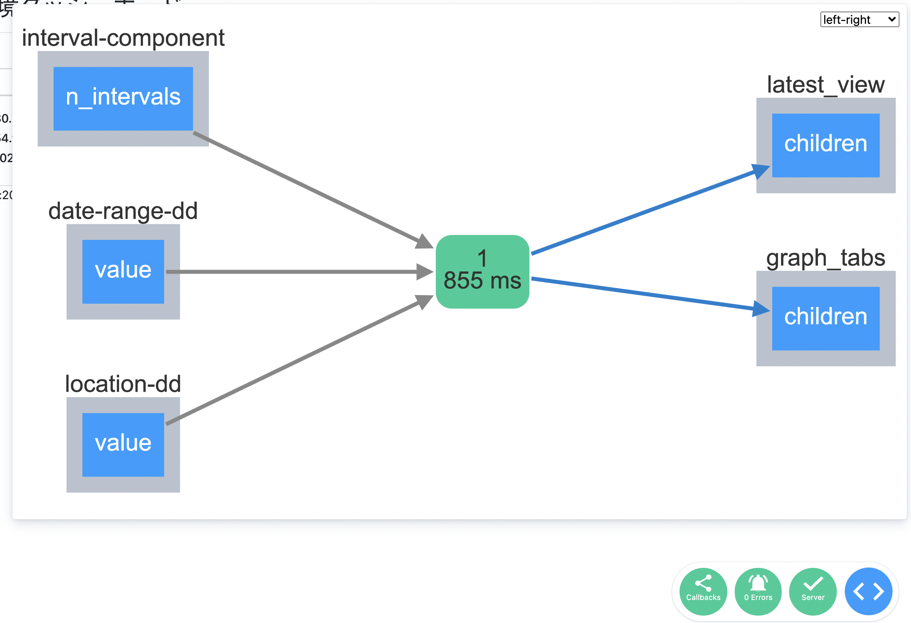

# ラズパイとDashで環境ダッシュボードを作ろう

PyCon JP 2021
2021/10/15 ~ 10/16

---

## お前誰よ

- 佐野浩士（Hiroshi Sano）[@hrs_sano645](https://twitter.com/hrs_sano645)
  - 🏠:静岡県の富士市🗻
- Job💼
  - [株式会社佐野設計事務所](https://sano-design.info)
  - 米農家🌾
- Community🙋
  - Python駿河, PyCon mini Shizuokaスタッフ
  - Code for ふじのくに

<!-- _footer:  -->

---

## 目次

- 環境ダッシュボードを作った話
- PythonとIoT
  - CurcitPythonとラズパイを使う選択
- Plotly Dashでダッシュボードアプリを作る
  - Dashの特徴を紹介
  - センサー情報を可視化する
- まとめ

<!-- _footer:  -->

---

本日のテーマ

### ラズパイとDashで環境ダッシュボードを作ろう

<!-- _footer:  -->

---

- ラズパイ
  => **Raspberry Pi**
- Dash
  => **Plotly Dash**
- 環境ダッシュボード
  => 環境センサー（今回は温度湿度気圧）を記録とグラフを表示する
  **ダッシュボードアプリ**

---

### このトークの趣旨、モチベーション

- 私的プロジェクトを紹介しつつ、Pythonを使ったIoTとデータ可視化を
  デモを交えてお伝えします
  - IoT:Pythonでセンサーデータを扱う
  - データ可視化: Pythonでダッシュボードアプリを作る

このトークで言いたいこと

- 世の中にない、けどほしいなら自分で作ろう
- 世の中に存在しないデータを集めて見てみよう
  - 身近だけど見えないデータ

---

### homeenvdashプロジェクトの紹介


環境センサーの情報が見れるダッシュボードアプリを作りました

このプロジェクトのモチベーションを紹介します。

---


- ラズパイ+環境センサーを接続してセンサーノード
- ダッシュボードアプリはDashを利用する
- さまざま/複数の環境センサーと接続して
  1つのダッシュボードでモニターできる
  - 複数の部屋や種類が異なるセンサーを扱える

<!-- _footer: 現在は、温度湿度気圧のBME280に対応。今後はCO2や非接触温度センサなどに対応したい -->

---

### なぜ作ったのか？


---

そもそも、センサーやダッシュボードはすでに製品サービスが多数ある

---


- センサーは市販にも販売されている
- ダッシュボードもさまざまなプロジェクトがある
  - OSSなサーバーアプリ
  - サービスとして提供されているもの

なんで作る必要があるか？

<!-- _footer: 車輪の再開発ってやつ -->
---


### 低気圧の体調不良に対応したかった

- 低気圧に弱いので調子が悪くなる前兆を調べたい
- 予報サービスはあるけど現在の状態を見たい
- 世の中にはIoTの製品はあるものの、
  **気圧を見られるものが意外となかった**

---


### 見守りに使う

- 実家の祖母の部屋の状況を見れるよう
  気をつけるために利用していました
- 高齢者は気温に対して間違えやすい
  - 体感より数値化された状態を見た方が対応しやすい
- センシティブな環境でもあったので、余り外部サービスを使いたくなかった

---

### 欲しいものを自分で作る


- Makerという文化
- ものづくりが好きである
- 世の中に存在していなければ
  自分で作る精神！

<!-- _footer: 車輪の再開発上等だ！という文化です -->

---

世の中に存在していなければ自分で作る！


<!-- _footer: 小池さん:http://workpiles.com/2016/08/ccb9-prototype2-complete/  からあげさん:https://karaage.hatenadiary.jp/entry/2019/11/06/073000 -->

---

個人的に解決したい問題として

---


ラズパイが大量に転がっているので有効活用することが目的

<!-- _footer: 実際のところみなさんもありますよね？積みボード -->

---


> https://twitter.com/karaage0703/status/1413347181705105410?s=20

<!-- _footer: やっぱり闇のエンジニアはちげーわ！ -->
--- 

積みボードがある方は贅沢に使って快適な日常を手に入れる！

<!-- _footer: ラズパイは一応2台ぐらい有効活用してます。踏み台サーバーとか実験用とか... -->

---

### homeenvdashの全体構成


---

- センサーノードはラズパイ + センサーを接続
- センサーノードは複数対応
- ダッシュボードはDash + Plotly
- センサーで取得した情報はGoogleスプレッドシートで保存
  - 今後はローカルなDBに保持して、エクスポートする形が望ましい

---

今日は `homeenvdash-mini` というデモ用のアプリを使って解説します。

honeenvdash-miniはこちら -> 

https://github.com/hrsano645/homeenvdash-mini

---

## PythonとIoT

より手軽にPythonとIoTを行う方法を紹介します

---

### PythonでIoTを行う選択肢

- Raspberry Pi + CPython
- MicroPython / CircuitPython
- Raspberry Pi + Blinkaライブラリ（CircitPython）

<!-- _footer: 上記は私が知っている限りで一例です。ほかにも選択したがある場合は教えていただけると嬉しいです -->

---


---

### Raspberry Piとは

- もともとは教育目的のLinuxが動作するシングルボードコンピューター（SBC）
  - 工場自動化やサイネージ、センサーノードとして業務利用も
  - クラスター構成を作ってクラウドっぽく（おうちクラウドと呼ばれている）
- インターフェイスが豊富
  - WLAN, Ethernet, USB, Bluetooth, HDMI出力
- GUI/CUIで利用可能
  - 最新版は高性能なのでデスクトップ端末としても
  - ヘッドレスなサーバーとしても扱える

<!-- _footer: ちょっと工夫はいるけどルーターを作ることもできます。便利ですよ -->

---


---

## Raspberry PiとIoT

特徴は

- Linuxが動くのでCPythonを扱える
- GPIO（デジタル）でセンサーと接続可能
- シリアル通信規格対応: SPI, I2C
- ディスプレイを繋ぐとサイネージ的なデバイスも作れる

⭕️ 安価ながら高機能なIoT端末として扱える
🔺 **ACアダプタなど給電環境が必要** 電源がない環境では扱いづらい

---

### MicroPythonとは


- MicroPythonはマイコンボード向けの処理系
  - マイコン=マイクロコントローラ
  - CPUより用途が限られている
  - 特定の機器制御に最適化された集積回路
- [クラウドファンディング](https://www.kickstarter.com/projects/214379695/micro-python-python-for-microcontrollers)で生まれたpyboardの開発環境として作られた

<!-- _footer: MicroPython micropython.org -->

---

### CircuitPythonとは


- MicroPythonの派生版
  - adafruitというSTEAM系に取り組んでる電子部品の販売や教育分野のメーカーが作成
- adafruitのボードに対応したり、専用のライブラリを用意
  - メーカーのセンサーデバイスと接続しやすい

<!-- _footer: CircuitPython https://circuitpython.org -->

---


### MicroPython/CircuitPythonの特徴

- CPythonの3系（3.4, 3.5の一部）の文法をベースにした独自の実装系
- マイクロコントローラー向けカスタムした標準ライブラリやサードパーティライブラリがある
- シリアルコンソールからREPLが動く
- 他のボードにもポートされてインストール可能

⭕️ Raspberry Piより安価。電源はバッテリーも
🔺 CPythonライクだが完全互換ではない

<!-- _footer: 写真はESP32+MicroPythonで水栓を開け閉めするものを作ってました -->

---


---

### CircuitPythonのライブラリをRaspberry Piで扱う

- blinkaというライブラリを使う
  - [CircuitPython on Linux and Raspberry Pi](https://learn.adafruit.com/circuitpython-on-raspberrypi-linux)
  - CircuitPythonで使うマイコンボードの機能をRaspberry Pi向けに変換するレイヤー
- CircuitPython向けのライブラリをRaspberry Piで扱うことができる（すべてではない） 
  - Raspberry PiとCircityPythonのコードの相互利用もやりやすい（らしいです）

⭕️ CircityPythonのライブラリを使うことで接続センサーの扱いが楽
🔺 どちらかの環境依存のコードを書く場合は扱いが難しい

---


---

### センサー情報取得の実例: BME280という温度湿度センサーから情報を取得する


Rasberry Pi + Blinkaライブラリを使って、
デモしながら様子を見せていきます

- 実際にラズパイ4BとBME280を接続します
- BME280はこちらものを使ってます
  - SPI接続です（I2Cの場合接続方法とセンサーのコードが少し違います）

---


まずは必要なものを揃えます

- 必要な物を用意する: ブレットボード、ワイヤー、BME280（利用するセンサー）
- 道具: はんだごて、はんだ、はんだこて台
  センサーにピンが実装されていない場合は必要です
- 購入先:
  Amazonとかでも集まる。
  [秋月電子通商](https://akizukidenshi.com/catalog/default.aspx)、[スイッチサイエンス](https://www.switch-science.com/)、[aitendo](https://www.aitendo.com/)、
  [マルツオンライン](https://www.marutsu.co.jp/)、[せんごくネット通販](https://www.sengoku.co.jp/) がおすすめ

---

配線の様子を見せます

---

### 配線方法まとめ


- 配線は一例です。
- 画像で利用しているBME280はAE-BME280ではないので、表を元に配線してください

---

環境作成してデモを見せながら披露

---

動作させたテストコードの例

```python
# test_bme280.pyのコードをサンプルとして載せる
```

---

### Tips: Raspberry PiでPython開発をしやすくする

VS Codeのリモート開発が便利です -> Remote-SSH

- ssh経由で扱うといい。ただpi3あたりからでないと、リモート開発できない（vscodeのリモートサーバーが対応するCPUアーキテクチャの問題）
- <https://www.raspberrypi.org/blog/coding-on-raspberry-pi-remotely-with-visual-studio-code/>
> Remote SSH needs a Raspberry Pi 3 or 4. It is not supported on older Raspberry Pis, or on Raspberry Pi Zero.

---

## Dashでセンサー情報を可視化する

Dashライブラリを使ってセンサー情報を表示する
ダッシュボードを作ります

---

### Dashの紹介

- Plotlyが作成しているWebアプリフレームワーク
  - Plotlyはグラフライブラリの名称でもある: `Plotly.js`、`Plotly.py`
- Plotlyとセットで使うと、データ分析向けのプロトタイピングがしやすい
- サンプル（有料機能を使ったものもあるので注意）<https://dash.gallery/Portal/>
  - ライブラリのサンプルには自動運転時の状況の可視化とかもある。
  かなりおもしろい

---

### Dashの特徴

- Dashは flask + reactで作られている。
  > Built on top of Plotly.js, React and Flask, Dash ties modern UI elements like dropdowns, sliders, and graphs directly to your analytical Python code. Read our tutorial proudly crafted ❤️ by Dash itself.
- （ほぼ）PythonのみでWebサイト構成が作れる
- コールバック機能を使ってインタラクティブ操作が可能
- データセットやDBを扱いたい場合は自前で用意
  - pandasを使ってplotlyのグラフを作れるので、pandas経由で何かしらをするときに便利

---

### （ほぼ）PythonのみでWebサイト構成が作れる

- HTMLを書く必要がない
- htmlのフォームや構造をラッピングしたコンポーネントを呼び出して構成を用意する
- plotlyと連携して豊富なグラフを扱うことができる
- htmlな操作は知らないと扱いづらい

---

```python
from dash import Dash, callback, html, dcc, Input, Output

# dashアプリの初期化
app = Dash(
    __name__,
    meta_tags=[{"name": "viewport", "content": "width=device-width, initial-scale=1"}],
)
app.title = "Hello Dash App"

def _layout():
    """アプリの全体のレイアウト"""
    return html.Div(
        [
            html.H2(app.title),
            html.Label("PythonのみでWEBアプリを作ります")
        ],
    )

if __name__ == "__main__":
    app.layout = _layout
    app.run_server(debug=True, host="0.0.0.0")
```

---


```python
from dash import Dash, callback, html, dcc, Input, Output

# dashアプリの初期化
app = Dash(
    __name__,
    meta_tags=[{"name": "viewport", "content": "width=device-width, initial-scale=1"}],
)
app.title = "Hello Dash App"

def _layout():
    """アプリの全体のレイアウト"""
    return html.Div(
        [
            html.H2(app.title),
            html.Label("PythonのみでWEBアプリを作ります")
        ],
    )

if __name__ == "__main__":
    app.layout = _layout
    app.run_server(debug=True, host="0.0.0.0")
```

---

### フォームなどの操作から動的な変更:コールバック機能

- dashは動的な操作を可能にするためのコールバックという機能がある
- たとえばグラフの種類を変更することができる: 実演
- homeenvdashでは
  - フォームで部屋ごとや温度湿度気圧を含めて操作をする
  - 定期的な表示の更新を行う（interval）

---

コード: callbackの様子

```python
# 動的な操作の例として
# ドロップダウンリストの種類が変わったときに、画像を置き換えるみたいなことをする
```

---

### Tips:ホットリロードによる開発

- 自動的にリロードしてくれる。デバッグモードを有効にしておくと開発しやすい

```python
if __name__ == "__main__":
    app.layout = _layout
    app.run_server(debug=True, host="0.0.0.0")
```


---

### デモ: センサー情報を可視化する

- 実演:センサー情報の取得方法は、直接センサーの値を取りに行く
- 時系列グラフを作るなら、データの記録は必須になる。
  - 実際のところはファイルかDB, 外部のデータソースへ保存して扱う方がわかりやすい
  - 今回はCSVファイルに10分1週間分の保存を行う設定

---

### センサーの最新の値を見る


---

### 記録したセンサーの値をグラフ化する


---

### Tips: htmlっぽい構造は作る必要がある

複雑なアプリやレイアウトを作ると、構造も複雑になる

- 複雑になるので関数などで部品（カプセル）化していく
- コールバックで更新したい部分をカプセル化すると、コールバック側の更新処理を作る時に呼び出しやすい
- 慣れてくるとwebアプリを書いている様な扱いになってくる。
（別のモジュールにコンポーネント用意して呼び出すなど）

---

```python
# homeenvdashを例に、更新するグラフの関数を見せて、callback側での様子も見せる
```


---


### tips: Bootstrapを使ってデザインを良くする

Dashの便利なライブラリ: Dash bootstrap componets（dbc）によるデザインの整え方

- Dashのデメリットは、CSSを扱ったデザインがしづらい
  - レスポンシブ対応とか
- CSSフレームワークのBootstrapを扱いやすいコンポーネントで
まとめたライブラリがある

---

### デモ: デザインを整えてみる

---


---

### まとめ（3min

環境センサーのダッシュボードhomeenvdashを紹介しつつ

- ラズパイでセンサー情報を取りに行く手段でおすすめな方法を紹介
- ダッシュボードアプリをplotlyのdashで作成
- 言いたいこと
  - PythonのIoT活用をしてみよう
  - 日常のデータを見れる世にしてみよう
  - 積みボードを活用していこう。

---


---

## 最後にお知らせ

---

### 

---

### PyCon  mini Shizuoka 2021 やります

- ## PyCon mini Shizuoka 2021

開催します🎉

- 2021/11/20 土曜日
- 詳しくは公式サイトをチェック
  - shizuoka.pycon.jp/2021
- LTと参加者募集をします

---

