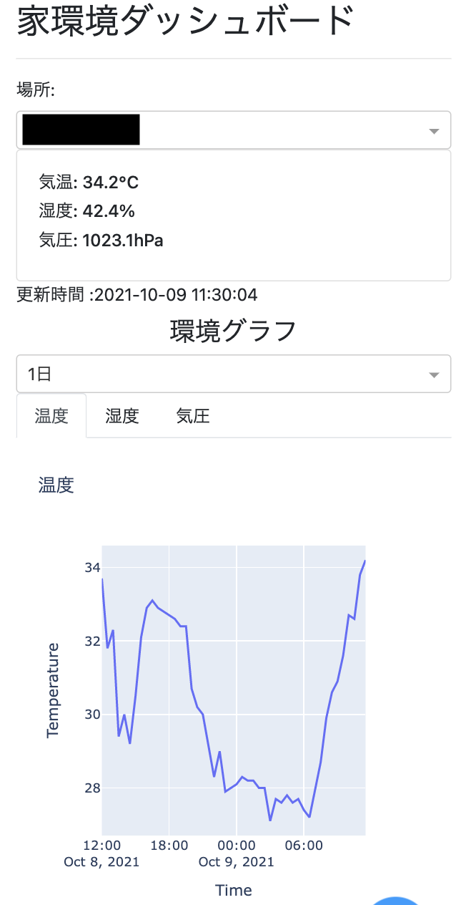
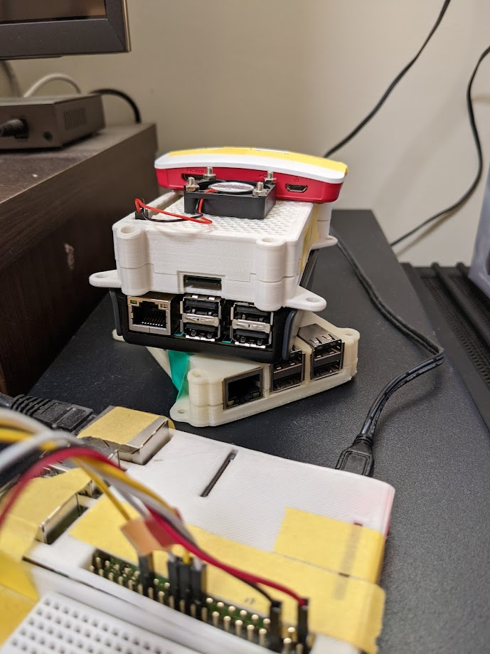
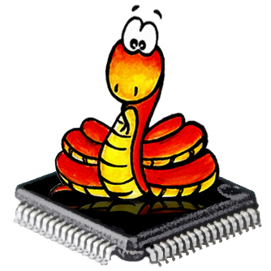
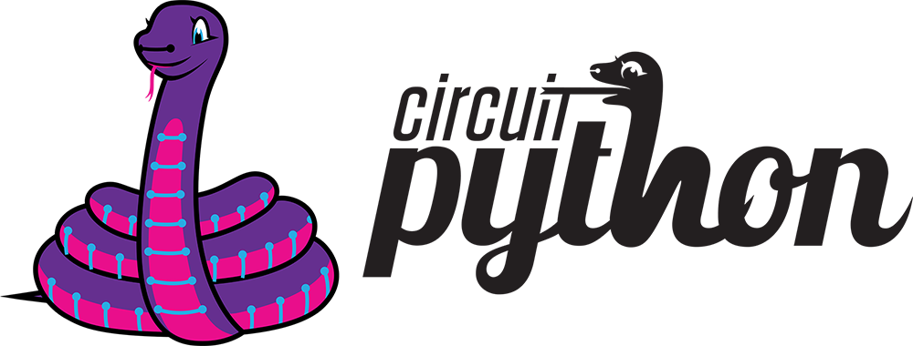

# ラズパイとDashで環境ダッシュボードを作ろう

PyCon JP 2021
2021/10/15 ~ 10/16

---

## お前誰よ

- 佐野浩士（Hiroshi Sano）[@hrs_sano645](https://twitter.com/hrs_sano645)
  - 🏠:静岡県の富士市🗻
- Job💼
  - [株式会社佐野設計事務所](https://sano-design.info)
  - 米農家🌾
- Community🧑‍💻
  - 🐍: Python駿河, PyCon mini Shizuokaスタッフ
  - 🏙💻: Code for ふじのくに

<!-- _footer:  -->

---

## 目次

- 環境ダッシュボードを作った話
- PythonとIoT
  - CurcitPython
- Plotly Dashでダッシュボードアプリを作る
  - Dashの特徴を紹介
  - センサー情報を可視化する
- まとめ

<!-- _footer:  -->

---

本日のテーマ

### ラズパイとDashで環境ダッシュボードを作ろう

<!-- _footer:  -->

---

- ラズパイ
  => Raspberry Pi
- Dash
  => Plotly Dash
- 環境ダッシュボード
  => 環境センサー（今回は温度湿度気圧）を記録とグラフを表示する
  ダッシュボードアプリ

---

### homeenvdashプロジェクトの紹介



環境センサーの情報が見れるダッシュボードアプリを作りました

このプロジェクトのモチベーションを紹介します。

---


- ラズパイ+環境センサーを接続してセンサーノード
- ダッシュボードアプリはDashを利用する
- さまざま/複数の環境センサーと接続して1つの
  ダッシュボードでモニターできる様にするのが目的

<!-- _footer: 現在温度湿度気圧センサーのBME280のみに対応。今後はCO2センサーに対応したい -->

---

### なぜ作ったか？


---

そもそもセンサーやダッシュボードはすでに製品サービスが多数ある

---

< 画像で市販のサービス, ダッシュボードの紹介>


- センサーは市販にも販売されている
- ダッシュボードもさまざまなプロジェクトがある

なんで作る必要があるか？

<!-- _footer: 車輪の再開発ってやつ -->
---


### 低気圧の体調不良に対応したかった

- 低気圧に弱いので調子が悪くなる前兆を調べたい
- 予報サービスはあるけど現在の状態を見たい
- 世の中にはIoTの製品はあるものの、
  **気圧を見られるものが意外となかった**

---


### 見守りに使う

- 実家の祖母の部屋の状況を見れるよう
  気をつけるために利用していました
- 高齢者は気温に対して間違えやすい
- 体感より数値化された状態を見た方が対応しやすい
  - => 誰でも同じ

---

### 欲しいものを自分で作る精神


- Makerという文化
- ものづくりが好きである
- 世の中に存在していなければ
  自分で作る精神！

<!-- _footer: 車輪の再開発上等だ！という文化です -->

---

世の中に存在していなければ自分で作る

< 小池さんの例 : きゅうりAIの第一号>

< からあげさんの例 : >

---



ラズパイが大量に転がっているので有効活用することが目的

<!-- _footer: 実際のところみなさんもありますよね？積みボード -->

---


> https://twitter.com/karaage0703/status/1413347181705105410?s=20

<!-- _footer: やっぱり闇のエンジニアはちげーわ！ -->
---

積みボードがある方は贅沢に使って快適な日常を手に入れる！

<!-- _footer: 一応2台ぐらい有効活用してます -->

---

### homeenvdashの全体構成

<!-- TODO:2021-10-09 この絵はシュリンクして整理しなおす -->


---

- センサーノードはラズパイ + センサーを接続
- センサーノードは複数対応
- ダッシュボードはDash + Plotly
- センサーで取得した情報はGoogleスプレッドシートで保存
  - 今後はローカルなDBに保持して、エクスポートする形が望ましい

---

## PythonとIoT

より手軽にPythonとIoTを行う方法を紹介します

---

### PythonでIoTを行う選択肢


<!-- TODO:2021-10-09 ここは比較表を使ってまとめる -->


---

### Raspberry Piとは

- もともとは教育目的のLinuxが動作するシングルボード
  - 工場自動化やサイネージ、センサーノードとして業務利用も
- インターフェイスが豊富
  - WLAN, Ethernet, USB, Bluetooth, HDMI出力
- GUI/CUIで利用可能
  - 最新版は高性能なのでデスクトップ端末としても
  - ヘッドレスなサーバーとしても扱える

<!-- _footer: ちょっと工夫はいるけどルーターを作ることもできます。便利ですよ -->

---

< 画像で紹介 >

- 教育目的のデバイスとして
- 工場系
- 農場のセンサーとして

---

## Raspberry PiとIoT

特徴は

- Linuxが動くのでCPythonを扱える
- GPIO（デジタル）でセンサーと接続可能
- シリアル通信規格対応: SPI, I2C
- ディスプレイを繋ぐとサイネージ的なデバイスも作れる

⭕️ 安価ながら高機能なIoT端末として扱える
🔺 **ACアダプタなど給電環境が必要** 電源がない環境では扱いづらい

---

### MicroPython/CircuitPythonの紹介



- MicroPythonはマイコンボード向けの処理系
  - micropython.org
- クラウドファンディングで生まれたpyboardに載せたのが初出

<!-- _footer: MicroPython Kickstarterページ https://www.kickstarter.com/projects/214379695/micro-python-python-for-microcontrollers -->

---


特徴は

- CPythonの3系（3.4, 3.5の一部）の文法をベースにした独自の実装系
- マイクロコントローラー向けにカスタマイズした標準ライブラリやサードパーティライブラリを備える
- シリアルコンソールからREPLが扱える
- 他のボードにもポートされ、arduino系のボードで扱える
  - 便利なのはESP32系のマイコンボード

<!-- _footer: ESP32をよく使うM5Stack系が便利です。 -->

---

### CircuitPythonとは



- circuitpythonはMicroPythonの派生版。adafruitというSTEAM系に取り組んでる電子部品の販売や教育分野のメーカーが作成
- そのメーカーのボードに対応したり、専用のライブラリを用意
  - メーカーのセンサーデバイスと接続しやすい

<!-- _footer: CircuitPython: https://learn.adafruit.om/welcome-to-circuitpython  -->

---


PythonとIoTは扱いやすさもあって環境がとてもいい

---

### CircuitPythonのライブラリをRaspberry Piで扱う

- blinkaというライブラリを使う。 [Overview | CircuitPython on Linux and Raspberry Pi | Adafruit Learning System](https://learn.adafruit.com/circuitpython-on-raspberrypi-linux)
- circuitpython向けのコードやライブラリをraspberry pi上でも扱える様にしているライブラリがある。
- blinkaはcircuitpythonで使うマイコンボードの機能をraspberry pi向けに変換するレイヤー。

<!-- _footer: もちろんラズパイ向けのコードやライブラリはcircuitpythonでは動かないので注意 -->

---


---

### センサー情報取得の実例: BME280という温度湿度センサーから情報を取得する
 


デモしながら様子を見せていきます

- 実際にラズパイ4BとBME280を接続して動かしてみる
- BME280はこちらものを使ってます
  - SPI接続です（I2Cの場合接続方法とセンサーのコードが少し違います）

---

<画像: ワイヤーやセンサーを載せて左側に載せる>

まずは必要なものを揃えます

- 必要な物を用意する: ブレットボード、BME280、ワイヤー
- Amazonとかでも集まる。
  [秋月電子通商](https://akizukidenshi.com/catalog/default.aspx)、[スイッチサイエンス](https://www.switch-science.com/)、[aitendo](https://www.aitendo.com/)、
  [マルツオンライン](https://www.marutsu.co.jp/)、[せんごくネット通販](https://www.sengoku.co.jp/)がおすすめ

---

配線の様子を見せる

---

デモを見せながら披露

---

- Tips: Raspberry PiでPythonを扱う方法:

VSCodeのリモート開発が便利です

- ssh経由で扱うといい。ただpi3あたりからでないと、リモート開発できない（vscodeのリモートサーバーが対応するCPUアーキテクチャの問題）
- <https://www.raspberrypi.org/blog/coding-on-raspberry-pi-remotely-with-visual-studio-code/>
> Remote SSH needs a Raspberry Pi 3 or 4. It is not supported on older Raspberry Pis, or on Raspberry Pi Zero.

---

## Dashでセンサー情報を可視化する

---

### Dashの紹介

- plotlyという企業、またグラフライブラリ、が作成しているWebアプリフレームワーク
- plotlyがこのグラフライブラリを使いつつwebアプリを簡単に作れる
  - データ分析向けにプロトタイピングしやすくしたライブラリがdash
- サンプルもたくさん（有料機能を使ったものもあるので注意）<https://dash.gallery/Portal/>

---

### Dashの特徴

- dashは flask + reactで作られている。
  > Built on top of Plotly.js, React and Flask, Dash ties modern UI elements like dropdowns, sliders, and graphs directly to your analytical Python code. Read our tutorial proudly crafted ❤️ by Dash itself.
- （ほぼ）PythonのみでWebサイト構成が作れる
- コールバック機能を使ってインタラクティブ操作が可能
  - ライブラリのサンプルには自動運転時の状況の可視化とかもある。かなり面白い
- dbを扱いたい場合は自前で用意。
  - pandasを使ってplotlyのグラフを作れるので、pandas経由で何かしらをするときに便利

---

### （ほぼ）PythonのみでWebサイト構成が作れる

- HTMLを書く必要がない
- htmlのフォームや構造をラッピングしたコンポーネントを呼び出して構成を用意する
- plotlyと連携して豊富なグラフを扱うことができる
- htmlな操作は知らないと扱いづらいはづらい

---

```python
# homeenvdash mini
from dash import Dash, callback, html, dcc, Input, Output

# dashアプリの初期化
app = Dash(
    __name__,
    meta_tags=[{"name": "viewport", "content": "width=device-width, initial-scale=1"}],
)
app.title = "Hello Dash App"

def _layout():
    """アプリの全体のレイアウト"""
    return html.Div(
        [
            dcc.Location(id="url", refresh=False),
            html.H2(app.title),
            html.Label("PythonのみでWEBアプリを作ります")
        ],
    )

if __name__ == "__main__":
    app.layout = _layout
    app.run_server(debug=True, host="0.0.0.0")
```

---


```python
# homeenvdash mini
from dash import Dash, callback, html, dcc, Input, Output

# dashアプリの初期化
app = Dash(
    __name__,
    meta_tags=[{"name": "viewport", "content": "width=device-width, initial-scale=1"}],
)
app.title = "Hello Dash App"

def _layout():
    """アプリの全体のレイアウト"""
    return html.Div(
        [
            dcc.Location(id="url", refresh=False),
            html.H2(app.title),
            html.Label("PythonのみでWEBアプリを作ります")
        ],
    )

if __name__ == "__main__":
    app.layout = _layout
    app.run_server(debug=True, host="0.0.0.0")

```

---

### フォームなどの操作から動的な変更:コールバック機能

- dashは動的な操作を可能にするためのコールバックという機能がある
- たとえばグラフの種類を変更することができる: 実演
- homeenvdashではフォームで部屋ごとや温度湿度気圧を含めて操作をする

---

コード: callbackの様子

---

### tips: と言ってもhtmlっぽい構造は作る必要がある

- これらは関数などでカプセル化していくとわかりやすい
- 慣れてくるとwebアプリを書いている様な扱いになってくる。
  （コンポーネント用意して呼び出すなど）

---

### tips:ホットリロードによる開発

- 自動的にリロードしてくれる。デバッグモードを有効にしておくと開発しやすい

---

### デモ: センサー情報を可視化する

- 実演:センサー情報の取得方法は、直接センサーの値を取りに行く
- 時系列グラフを作るなら、データの記録は必須になる。
  - 実際のところはファイルかDB, 外部のデータソースへ保存して扱う方がわかりやすい
  - 今回はCSVファイルに10分1週間分の保存を行う設定

---


---

### tips: Bootstrapを使ってデザインを良くする

- Dashの便利なライブラリ: Dash bootstrap componets（dbc）によるデザインの整え方
  - dashの利点は扱いやすいが、CSSなどのデザインはややしづらい
  - そこで、bootstrapを扱いやすいコンポーネントでまとめたライブラリがある
  - それらを使うことで、レスポンシブデザインがしやすいし、bootstrapのコンポーネントがdas上で扱いやすい

---

### デモ: デザインを整えてみる

---

### まとめ（3min

環境センサーのダッシュボードhomeenvdashを紹介しつつ

- ラズパイでセンサー情報を取りに行く手段でおすすめな方法を紹介
- ダッシュボードアプリをplotlyのdashで作成
- 言いたいこと
  - PythonのIoT活用をしてみよう
  - 日常のデータを見れる世にしてみよう
  - 積みボードを活用していこう。
  - 

### おしらせ: pycon mini shizuoka やります。 LTと参加者募集をしていきますー

---

つまづきポイントの記事は参考になる -> https://qiita.com/chromia/items/4b91d8b6ca520782672c