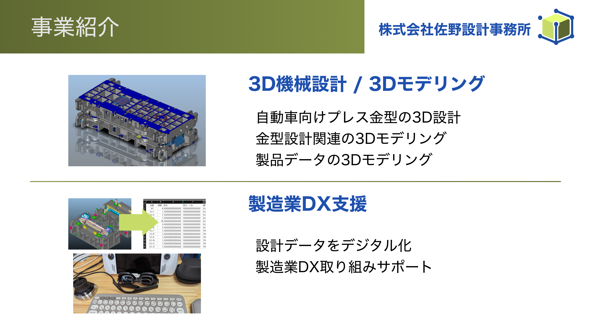

# 非同期タスクキューを使って業務を自動化しまくった話

はんなりプログラミング: １年の締めくくり！2023年にチャレンジしたことのLT祭
2023-12-15  

佐野  浩士 @hrsano645

---

## お前誰よ / Self Introduction

佐野 浩士（Hiroshi Sano）[@hrs_sano645](https://twitter.com/hrs_sano645)

* 🗺️: 静岡県富士市🗻
* 🏢: 株式会社佐野設計事務所 CEO
* 👥🤝
  * 🐍: PyCon mini Shizuoka Stuff / Shizuoka.py / Unagi.py / Python駿河
  * CivicTech, Startup Weekend Organizer
* Hobby: Camp🏕️,DIY⚒️,IoT💡

  

---



<!-- 

* 株式会社佐野設計事務所は自動車プレス金型という機械を設計する事務所です。3D CADを使い設計、また自動車業界に限らず、製品の3Dモデリングも扱っております。
* こういった設計データはデジタルデータになります。データを使い関連業務の改善に、Pythonやクラウドサービスなどを組み合わせて実現しています。
* 製造業なのですがデジタル化で取り組んでいまして、同じように取り組まれている方や、ご興味ある方がいましたら、後ほどのパーティでぜひ意見交換できたらと思います。
* もちろん静岡のPythonコミュニティとしても参加していますので、コミュニティスタッフとしてもお気軽にお声がけください！
-->

---

## 今年の本業の話

---

## 目標: 業務の効率化を限界まで進める

---

## 業務自動化ガッツリやりました

* 依頼ベースの案件業務
* 今まではそれほど多くなかったが今年になって急激に増える
  * 人力でやっていては追いつかなそうでやばい
* 人力でやるのを止める
  -> **止めることに成功した！！🙌😆**

---


---

## どんなことを効率化していたか

* 自動生成
  * 依頼受注→ボイラープレートツールで作業プロジェクト
  * スケジュール管理→Googleスプレッドシート連携
  * 会計サービスと連携して見積書/請求書生成（書類作成）
* タスク操作をChatOps
  * Google Chatでチャットボット作成
* 過去の依頼からサマリー情報のデータベース化: (現在取り組み中）

<!-- _footer: 始まりと終わりを自動化することで、中身の作業に集中できるような体制 -->

---

## これら全部、非同期タスクキューを使って作業させています

---

## なんで非同期にしたの？

* これらは重い処理: ファイル操作、APIアクセス
  * 組み合わせると**数秒ではなく数十秒〜分単位**の処理
  * 結果が返ってくるタイミングはその時次第
* 同期処理でやると、処理が終わるまで待たされる
  -> ブロッキング処理
* **チャットボット側がロックされてしまう->応答が返せない**
  基本チャットボットは非同期前提

---

Google Chatの場合

> 「同期的に応答するには、Chat アプリが 30 秒以内に応答し、その応答をインタラクションが発生したスペースに投稿する必要があります。それ以外の場合は、Chat アプリは非同期で応答できます。」
> <https://developers.google.com/chat/api/guides/message-formats?hl=ja#sync-response>

（[Slackの3秒](https://api.slack.com/interactivity/slash-commands#responding_basic_receipt:~:text=This%20confirmation%20must,ignore%20the%20request.)よりも全然緩いけど、非同期前提な様子）

---

## 非同期とは

* 同期処理と非同期処理の違い: 処理のオフロードと並列処理が可能。処理の待ち時間を有効活用できる
* チャットボットのために非同期処理を使うことになる: これが結局制約あるため
* ノンブロッキング処理: 処理が終わるまで待たされない（チャットの場合、応答が素早く返せる）

---

## Pythonでの非同期処理の選択肢

* 標準ライブラリ: threading, multiprocessing, asyncio, sub-interpriter(3.13以降)
* メッセージキュー活用:celery, rq, pyzmq(ZeroMQ)
* etc...

---

## 今回はRQ(python-rq)を使いました

python-rq: <https://python-rq.org/>

以下の3つの要素で構成される

* アプリ: タスク発行→キューへ入れる→キューから結果を受け取る
* ワーカー: タスクの処理を行う
* redis: アプリとワーカーの間に入りキューとして利用

---

## 効率化を非同期タスクにするざっくりイメージ
<!-- 

* [業務]依頼を受ける
* [業務->アプリ->redis]依頼内容をタスクとしてキューに入れる
* [redis->ワーカー]キューからタスクを取り出し、ワーカーに渡す
* [ワーカー]ワーカーがタスクを実行する
* [ワーカー->redis->アプリ]ワーカーがタスクを完了したら、結果をキューに返す
* [アプリ->業務]キューの結果をアプリ側で受け取り結果を表示

これらをシーケンス図にする -->

[](https://mermaid.live/edit#pako:eNqFUstKw0AU_ZUw6_oDWXTlH7idzZCMGjTTmiYLKQUzoRVNwAdiEXxVrBRL05ULg9iPuZ02_oWTpJ1GWnAWwzD3nHPvOdwmMmomRTpq0COPMoNuW2TPITZmmjx14riWYdUJc7VZfyTCu_V_4C8QdCF4Xy851LQaGxjBGIIv4EN5Y1bUC_WtalXJ6dr0--HnWeKuxUUX_CvgYYFVEAnPWyyhotMW8ackAJ8Al48x-APwJfkN-AiCftbWH4p2H3ik5HKJrHNpLF0rEULgZyvFbJxb4OfiNAF_kUeZukGpRI2f0l60kbRwotAijqZJB078-cfl7PE-d7XykE5uVHdlYBXdv5xyhkX2fyzHSqDIvrBcHibtDeavCWaogmzq2MQy5RI1M3GM3H1qU4x0-TSJc4ARZi2JI55b2zlmBtJdx6MV5NVN4i4XDum75LBBW7_x1VtT)

---

## なぜRQを選んだのか

* asyncioと悩んだ -> RQがシンプルにできそうだったので
* celeryと悩んだ -> celeryを使うほどの規模ではなかったと思う

※I/Oバウンズ処理はasyncio, multiprocessingで可能
※なので、この選択肢がベストとは限らない（速度とか重さとか）
**※redisを使いたかったというのもある**

<!-- _footer: バウンドとは制限という意味 -->

---

## 注意

* RQはWindowsは非対応
  * WSLなら動かせる
  -> <https://python-rq.org/docs/#limitations>
* 今回はdockerで動かす例です
  * チャットボットも動かすのでどうせならLinux系がお手軽

---

ということで、ちょっぱやでDocckerで用意する場合の例

---

Dockerfile

```Dockerfile
FROM python:3.11
RUN pip install rq
```

---

compose.yml

```yml
```

---

## dockerで動かす時

* RQはredisへタスクを渡すときはpickelを使ってる
  * ワーカー側でもpickelで渡されたオブジェクトが理解できないといけない
  -> ワーカー側にも同じライブラリをインストールする必要がある
* 手っ取り早い方法として
  * タスク側もワーカー側も同じDockerfileを使う
  * ボリューム参照も同じにする
* タスクとワーカーを同時に動かすならcomposeが便利

---

## 簡単なサンプル

* とりあえずprintしてみる

---

## 実際に使う: ローカル

* ファイル操作を扱ってみる

---

## 実際に使う: クラウド側

* Googleスプレッドシート

---

## まとめ

* 自動化は重い処理をよく扱う
* 非同期を使うことで、重い処理を任せられ自動化の幅が広がる
* 退屈なこと/手作業は間違えるので自動化しよう

Google Chatアプリの話はまたどこかで〜

---

## 参考

* [メッセージキュー - Wikipedia](https://ja.wikipedia.org/wiki/%E3%83%A1%E3%83%83%E3%82%BB%E3%83%BC%E3%82%B8%E3%82%AD%E3%83%A5%E3%83%BC)
* [【Pythonで高速化】I / Oバウンドとか並列処理とかマルチプロセスとかってなんぞや #Python - Qiita](https://qiita.com/nyax/items/659b07cd755f2ced563f)

---

## Google Chatと合わせる時

* チャットボット側で操作をする -> タスクをキューに入れる
* チャットボット側に応答をする
* ワーカー側でタスクを実行する
* ワーカー側でチャット側に非同期で応答を返す
  * Google ChatならGoogle Chat REST APIで非同期応答できる
