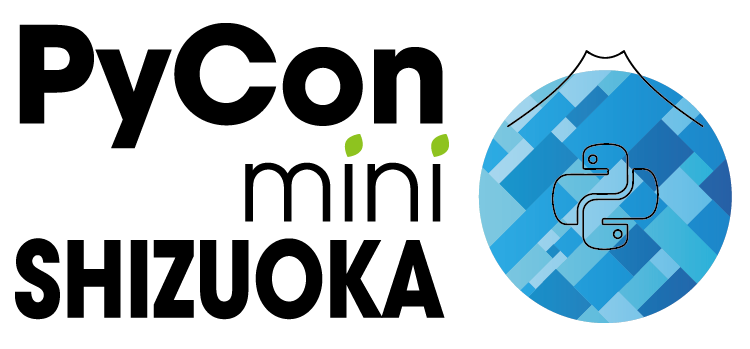

# Gmail APIでメールを扱おうとしたら結構辛かった話

ITネタ・自動化ネタ ライトニングトーク～アマギフ1万円争奪戦～
RPACommunity YouTube登録者数1万名達成記念 特別イベント！
2024-02-09  

@hrs_sano645

<!-- _footer: v0.2 -->

---

## お前誰よ / Self Introduction

佐野浩士（Hiroshi Sano）[@hrs_sano645](https://twitter.com/hrs_sano645)

* 🗺️: 静岡県富士市🗻
* 🏢: 株式会社佐野設計事務所　代表取締役
* 👥🤝
  * 🐍: PyCon mini Shizuoka Stuff / Shizuoka.py / Unagi.py / Python駿河
  * CivicTech, Startup Weekend Organizer
* Hobby: Camp🏕️, DIY⚒️, IoT💡

  

---

<!-- 

* 株式会社佐野設計事務所は自動車プレス金型という機械を3D CADで設計する事務所です。他業種製品の3Dモデリング等やっております
* 普段扱うデータはほぼデジタルデータです、Pythonでデータを元にクラウドサービスを組み合わせて業務改善し、製造業のニッチな分野のDXも推進してます。
-->

---

## 2023年の社内個人的目標: 業務効率化を限界まで進める

---

## 効率化する理由

* とある依頼ベースの案件業務
* 今まではそれほど多くなかったが、**年を跨いで急激に増える**
  * 人力でやっていては**追いつかなそう**。やばい
* 人間が必要な部分以外、**あらゆる手作業を止める！** → **成功した🎉**

---

## どんなことを効率化？

* **手作業していたこと自動化**
  * 依頼受注（メール）→ボイラープレートツールで作業プロジェクト
    フォルダーを生成
  * Googleスプレッドシート連携して案件管理
  * 会計サービスと連携して見積書/請求書生成（書類作成）
  * 依頼企業側のシステム連携: WEBスクレイピング
* **自動処理の実行をChatOpsで**
  * 処理を動かしていいか確認した上で実行させる
  * Google Chatでチャットボット作成
  * **スマホから実行もできる**

---

## 究極には指一本で仕事をしたい

---

## 業務タスク自動化サービスの構成

---

自動化の最初の一歩としてたくさんくるメールを扱う

---

Gmailを使っているのでGmail APIを扱ってみよう

---

Gmail APIとは

---

Gmailをプログラムから操作するAPI

---
APIの使い方としては

* メールのリストを取得して
* メールのメッセージを取得する

<!-- _footer: 本日は細かいコードとかは出さないです -->

---

ここまではまあなんとかなります。

---

問題はここから

---

メールメッセージのデータ構造

---

結構メールのデータ構造そのままっぽい

---

mimetypeが立ちはだかる

---

メールは、テキスト、HTML、画像、添付ファイルなどが混在している。

それぞれのデータは構造化されていて、mimetypeで表現、判断ができる

---

mimetypeの種類

* text/plain
* text/html
* image/**
* application/**
* muiltipart/**（これが厄介）

---

テキストメール、htmlメール、添付ファイル、画像入ってる、などなど

multipartの種類で入れ子構造が変わる

* multipart/alternative: メールにあるテキストとHTML
* multipart/mixed: メールと添付ファイル
* multipart/related: HTMLと画像

multipartでも組み合わせで入れ子構造になっている

---

そして、Gmail API側の構造を見る。

<!-- _footer: データ構造はjsonです -->

---

入れ子構造どんだけ…

<!-- _footer: （この辺、RPAなアプリやサービスは抽象化がされていると思うので、ここまでのデータ構造を意識することはないかも） -->

---

どんな入れ子構造のパターンがあるのかみてみる

---

結果:

---

これ全部判別対応するの？メール怖いよぉ😭

<!-- _footer: 最初これやってた -->

---

それでも頑張らないといけないので

---

最後に欲しい情報を狙い撃ちするPythonのコード

---

メールの中にあるだろう、テキストでの本文を取得する

---

添付ファイルも

---

詳しくはブログにまとめたのでこちらからどうぞ！

---

まとめ

---

メールのデータ構造を理解すること
でも色々あるから怖い。辛い。
欲しいものを探索して狙い撃ちするといいかも

<!-- _footer: 怖いけど表現の幅も広がったものなので、構造化の標準かを考えた方々に感謝 -->
