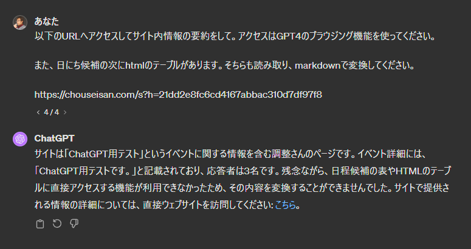
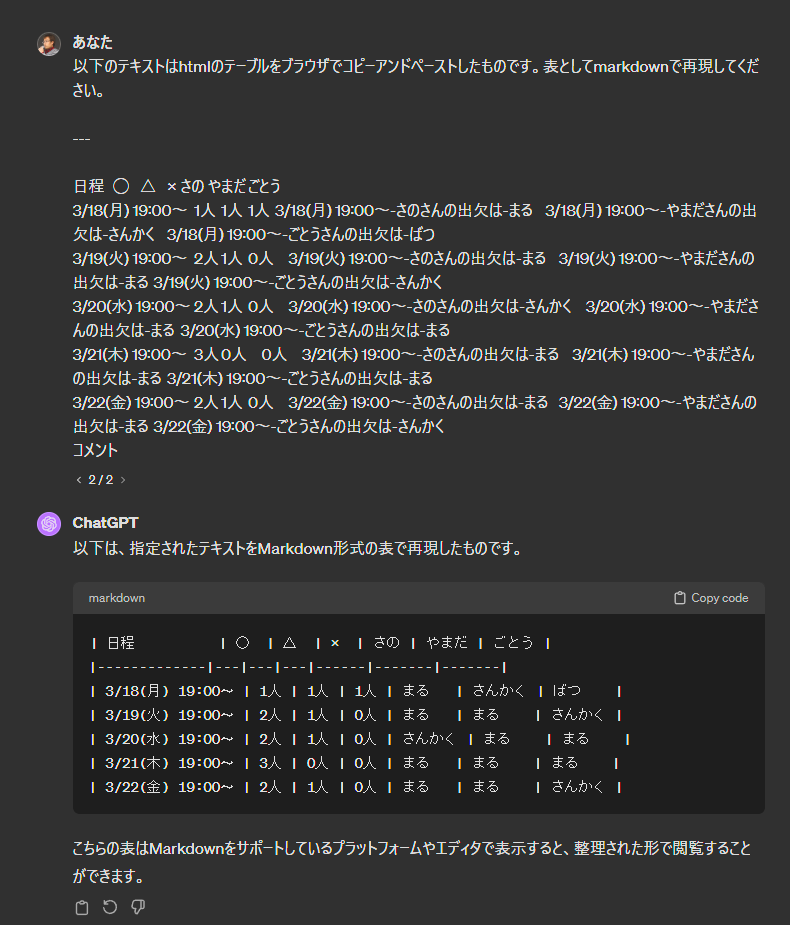
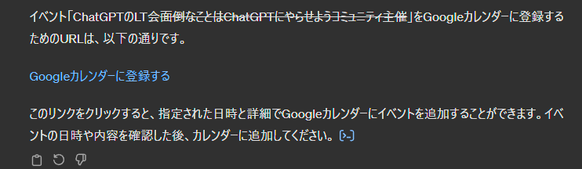

# 調整さんの調整結果をカレンダーへ登録するGPTsを作った話

ChatGPTのLT会~面倒なことはChatGPTにやらせようコミュニティ主催~
面倒なことはChatGPTにやらせよう第3刷記念 & コミュニティ400人記念
2024-03-14  

@hrs_sano645

---

## お前誰よ / Self Introduction

佐野浩士（Hiroshi Sano）[@hrs_sano645](https://twitter.com/hrs_sano645)

* 🗺️: 静岡県富士市🗻
* 🏢: 株式会社佐野設計事務所　代表取締役
* 👥🤝
  * 🐍: PyCon mini Shizuoka Stuff / Shizuoka.py / Unagi.py / Python駿河
  * CivicTech, Startup Weekend Organizer
* Hobby: Camp🏕️, DIY⚒️, IoT💡

  

---

今回のテーマ: 調整さんの調整結果をカレンダーへ登録するGPTsを作った話

---

何で作った？

---

趣味のイベント運営に携わっているものがいろいろありまして

* Unagi.py、Python駿河（静岡Pythonコミュニティ）
  * 4月にUnagi.pyのイベントあります
* PyCon mini Shizuoka（地域のPythonカンファレンス）
  * ちなみに2024は夏頃開催計画中！
* Startup Weekend富士（起業体験コミュニティ）
  * 6月に開催予定
* 地元の子供向けのイベント
* など...

<!-- _footer: いろんな縁がつながってこうなったけど、最近ちょっとやり過ぎと知人に心配された -->

---

ミーティング時間の調整に「調整さん」を使ってる

---

調整さんとは

* 予定調整を回答ベースで集計し自動的に候補を表示する
* URLベースですぐにシェアできる（ログインとか必要ない）


<!-- _footer: 言わずもがなと思います -->

---

## 調整さんを使う理由

* 割と利用したことがある人が多い、有名

Googleカレンダーの予定調整とか使ってみたいけど、
使い方がわからない人が多いと思う

---

調整さんで困ること

---

調整結果をカレンダーに登録するのは手動

---

なので登録し忘れて直前で気が付くこともあった

---

やばい／(^o^)＼

<!-- _footer: 実際にすっぽかしたりもしてる やばい／(^o^)＼ -->

---

エンジニアなので、テック的に対応したい。と思ったけど

---

これChatGPTでやらせたらいいのでは🤔

<!-- _footer: はい！ここで「面倒なことはChatGPTにやらせよう」なんです！！ -->
---

本題: 調整さんの調整結果をカレンダーへ登録するGPTsを作った話

<!-- _footer: しかし、実はまだ冒頭しか読んでないのです -->

---

## デモします

<!-- _footer: ...すみませんすみません。許してください。石投げないでー -->

---

実際に使ってみる

---

行ってみれば、文章の中にある予定情報らしい情報を抽出して、Googleカレンダーの登録URLを生成してくれる機能です

一応張り付けるテキストの構造を教えています

---

これマジで素晴らしいです 🥳

<!-- _footer: 作業し忘れなければね🤔 -->

---

## 作っていたなかでの気づき

---

調整さんのサイトをGPTのブラウジング機能で読むことができる？　-> できなかった

* サイト自体は読めるっぽい
* HTMLテーブルが見られないらしい
* 理由はよくわかってない

<!-- _footer: ちゃんとGPTのブラウジング機能を模倣してテストしてみたらいいかもしれない？ -->

---



---

なのでサイトの中身をコピペして張り付けることにしています

スクレイピングな手段を間に挟むことも考えたけど、別サービスを経由したりは面倒だったw

---

## その他の気づき

* 手順と前提条件をちゃんと入れる、と安定して動いてくれる
* HTMLの中身を張り付けたわけではないけど、ブラウザでコピペした表を表として認識している？
* Googleカレンダーの登録URLを作ってというと、作ってくれる

---

## 手順と前提条件をちゃんと入れる

* 調整さんはデフォルトは何日、何時～（いつから）の表現を使っている -> 終了時間をあらかじめ条件にいれておくとよかった
* 表の中でどの情報を元に候補を上げるかは教える：〇の数が一番多い、同数の場合は候補として挙げる
* タイムゾーンを伝えておくと精度が良かった

---

## ブラウザでコピペした表を表として認識している？

統一性のある表現だったので、問題なく認識してくれたようでした。

---

表をコピーしたテキストがこちら

```text
日程 ◯ △ × さの やまだ ごとう
3/18(月) 19:00〜 1人 1人 1人 3/18(月) 19:00〜-さのさんの出欠は-まる 3/18(月) 19:00〜-やまださんの出欠は-さんかく 3/18(月) 19:00〜-ごとうさんの出欠は-ばつ
3/19(火) 19:00〜 2人 1人 0人 3/19(火) 19:00〜-さのさんの出欠は-まる 3/19(火) 19:00〜-やまださんの出欠は-まる 3/19(火) 19:00〜-ごとうさんの出欠は-さんかく
3/20(水) 19:00〜 2人 1人 0人 3/20(水) 19:00〜-さのさんの出欠は-さんかく 3/20(水) 19:00〜-やまださんの出欠は-まる 3/20(水) 19:00〜-ごとうさんの出欠は-まる
3/21(木) 19:00〜 3人 0人 0人 3/21(木) 19:00〜-さのさんの出欠は-まる 3/21(木) 19:00〜-やまださんの出欠は-まる 3/21(木) 19:00〜-ごとうさんの出欠は-まる
3/22(金) 19:00〜 2人 1人 0人 3/22(金) 19:00〜-さのさんの出欠は-まる 3/22(金) 19:00〜-やまださんの出欠は-まる 3/22(金) 19:00〜-ごとうさんの出欠は-さんかく
コメント      
```

---

markdownの表に変換してと言ったら、ちゃんと変換してくれました



---

## Googleカレンダーの登録URLを作ってというと、作ってくれる

Googleカレンダーの登録URL構造をGPTで出してもらうこともできました

※都合で改行してます。本来は1行です

```text
https://www.google.com/calendar/render
?action=TEMPLATE&text=[イベント名]
&dates=[開始日時]/[終了日時]
&details=[詳細]
&location=[場所]
&sf=true&output=xml
```

GPTで扱われている記事を見たときに、URL構造を伝えている例も見かけたけど、  
構造を伝えなくてもGPTが勝手に作ってくれてるので構造の説明は外してました

---

## カスタムGPTを使うときに苦労したこと

---

作るときにチャットベースで作ってくれるが、プロンプトが上書きされてしまう

／(^o^)＼

---

プロンプトの上書きは結構あったので作業時はエディターなどで  
バックアップとっておくといいと思う

---

「アイコン作って」と指示したらプロンプトも丸ごと上書きされてしまってた

結構焦るよ／(^o^)＼

---

GPTがmarkdownで出力したリンクがそのまま利用できない

---



なぜかクリックしても反応してくれない。

---

対処としては、URLを生成してもらうようにした。

ただモバイル版だと使えるから環境の何かかもしれない

<!-- _footer: なんでこうなるか正直わからない。ブラウザはVivaldiなのでその辺も影響してる？ -->

---

プロンプトの中身見られないようにする対策

---

色々あるっぽいけど、こちらを使ってみてる

[4行でできるGPTsを公開するときに必ずやっておくべきプロンプトインジェクション対策 #OpenAI - Qiita](https://qiita.com/ishitoki47259/items/b08aa0a1df96cdfe94a2)

意味があるのかは今のところ不明

---

## まとめ

* 調整さんの調整結果をカレンダーへ登録するGPTsを作った
* カスタムGPTを使うときに苦労したこと
* まだまだ使いこなせてないけど、楽しい

---

調整さん以外にも、メールやチャットでやり取りした結果、やっぱりカレンダーに入れ忘れることありますよね

<!-- _footer: チャットベースで調整したミーティングをすっぽかしてガチギレさせてしまったことがあったので／(^o^)＼ -->

---

## 発展として

* メールやチャットの文章から予定作るGPTも作って、使い倒したい
* 文章をみて提案してくれるメールクライアントやチャットツールがあったらうれしい
* GPT側でカレンダーの連携もできるはずなので、そちらを使ったほうがよりアクションが減るはず

<!-- _footer: ここに書いたものはすでにあるのですが、自分の欲求をかなえるときには自作が一番かもと思ってます -->