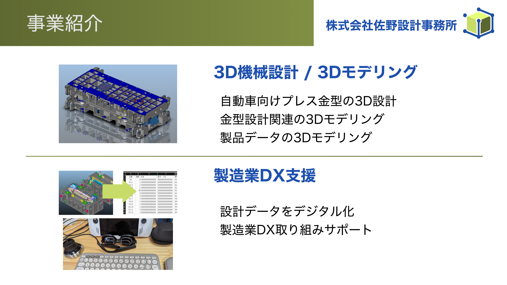

# Pythonで3Dモデリングをしてみよう: CadQuery Basic

PyCon mini Shizuoka 2024
2024-08-318

@hrs_sano645

---

## お前誰よ / Self Introduction

佐野浩士（Hiroshi Sano）[@hrs_sano645](https://twitter.com/hrs_sano645)

* 🗺️: 静岡県富士市🗻
* 🏢: 株式会社佐野設計事務所　代表取締役
* 👥🤝
  * 🐍: PyCon mini Shizuoka Stuff / Shizuoka.py / Unagi.py / Python駿河
  * CivicTech, Startup Weekend Organizer
* Hobby: Camp🏕️, DIY⚒️, IoT💡

  

---

<!-- 

* 株式会社佐野設計事務所は自動車プレス金型という機械を設計する事務所です。3D CADを使い設計、また自動車業界に限らず、製品の3Dモデリングも扱っております。
* こういった設計データはデジタルデータになります。データを使い関連業務の改善に、Pythonやクラウドサービスなどを組み合わせて実現しています。
* 製造業なのですがデジタル化で取り組んでいまして、同じように取り組まれている方や、ご興味ある方がいましたら、後ほどのパーティでぜひ意見交換できたらと思います。
* もちろん静岡のPythonコミュニティとしても参加していますので、コミュニティスタッフとしてもお気軽にお声がけください！
-->

---

## 本日の内容

Pythonで3Dモデルを作ってみようをテーマにデモを交えてお話しします！

* ものづくりと3Dモデリング：今回扱う3Dモデリング、3DCADの
  概要を説明します
* CadQueryの使い方: Pythonで扱える3D CADデモをしつつ
  * 最後に3Dプリンターで出力（できたらいいなー）

## 話さないこと

* Pythonの基礎的な話: Python Boot Campへ参加された方ぐらいのレベル想定です

---

3Dモデリングってやったことある方！！？

3Dプリンターを使って独自のものを作ったことがある方！！？

いましたら手をあげてください！🖐️

---

（木工、料理、裁縫、プラモデル、家具組みたて、プログラミング、などなど）

ものづくりをしたことがある方？🖐️

---

## 何かを作りたい時に、なにをするか？

---

料理だと、レシピを見る、材料を揃える、道具を用意する、手順を確認する、...

---

レシピ？手順？＝作って完成させるための設計がされている。

---

## 何かを作る時には設計をする

作りたいものに対して

* 完成しているものはどんな形か、機能はどうなっているか
* どんな材料を使うか
* どんな工程で作るか
* どんな道具を使うか
* ...

---

## 3Dモデリングは、設計の一つの手法

<!-- _footer: ※3Dゲームでは成果物にもなる。データ自体に価値がある場合のことです -->

---

## 2D図面と3Dモデル

ものづくりの設計は、2次元の図面から、立体物で見る3Dモデリングと技術が進化

* 2D図面：制作物に対して、上から見たり、横から見たり、断面を表現する
* 3Dモデル（3Dデータ）：立体物を表現することで、自由に制作物を見れる

<ここに 2d 3dの図形>

---

## 2Dと3Dでよく見るもの

点、エッジ、フェース、ソリッド、サーフェス、スプラインの概要

---

## 3Dのデータ形式

3D、メッシュデータ、ソリッドデータ、サーフェイスデータ

STL , STEP,

---

## CadQueryとは

<ここにロゴ>

---

## CadQueryとは

* Pythonでプログラマブルに3Dモデリングできるライブラリ
* （実質）パラメトリックモデリングができる

---

プログラマブルな3DCAD: そのほかの同種のCADもご紹介: OpenSCAD
Open CASCADE kernelを使ったプログラマブルな3DCAD

---

パラメトリック/ノンパラメトリックの違い: 特徴を説明します

---

3DCADの種類: プロプライエタリやOSSを交えて

---

## 最初のまとめ

* 3Dモデリングはものづくりの上での設計手法
* 3Dモデリングの種類、データ形式について説明
* CadQueryはPythonで3Dモデリングできるライブラリ

---

## CadQueryの環境の作り方: VSCode での作り方を紹介

---

* VSCodeを用意して
* OCP Cad Viewerのインストール
* OCP Cad ViewerでCadQuery環境を用意

---

## How to Use CadQuery Basic

デモを交えて紹介します

* ex1：基本的な構造物、セレクターの使い方
* ex2：入れ物を作る
* ex3：コースターを作る

---

ex1

作業面について:

ソリッドを作る: 立方体、球体など

CadQueryのセレクター

---

ex2 入れ物を作る過程で扱うこと

モデルを組み合わせたり、差分を取ったりブーリアン演算について扱います。

ファイルを出力する。メッシュデータのSTL、 ソリッドデータのSTEPを書き出します。

---

ex3 コースターを作る

3Dプリンターで出力してみる: 実際に3Dプリンターを動かす様子もお見せします（遠隔で操作をするので通信環境によっては中断する可能性もあります）

---

## まとめ

---

## 3Dモデリングでものづくりできる様になろう

Maker文化を紹介

---
