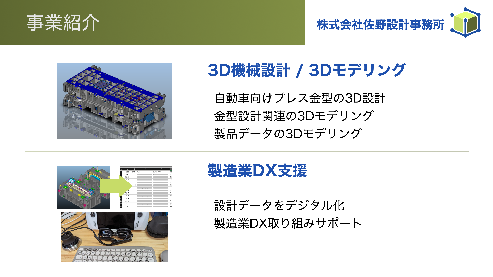

# slide title

[event name]
20**/**/**

---

## お前誰よ / Self Introduction

佐野 浩士（Hiroshi Sano）[@hrs_sano645](https://twitter.com/hrs_sano645)

* 🗺️: Shizuoka, Eastern part / 静岡県富士市🗻
* 🏢: 株式会社佐野設計事務所 CEO
* 👥🤝
  * 🐍: PyCon mini Shizuoka Stuff / Shizuoka.py / Unagi.py / Python駿河
  * CivicTech, Startup Weekend Organizer
* Hobby: Camp🏕️,DIY⚒️,IoT💡

  

---

<!-- 

* 株式会社佐野設計事務所は自動車プレス金型という機械を設計する事務所です。3D CADを使い設計、また自動車業界に限らず、製品の3Dモデリングも扱っております。
* こういった設計データはデジタルデータになります。データを使い関連業務の改善に、Pythonやクラウドサービスなどを組み合わせて実現しています。
* 製造業なのですがデジタル化で取り組んでいまして、同じように取り組まれている方や、ご興味ある方がいましたら、後ほどのパーティでぜひ意見交換できたらと思います。
* もちろん静岡のPythonコミュニティとしても参加していますので、コミュニティスタッフとしてもお気軽にお声がけください！
-->
